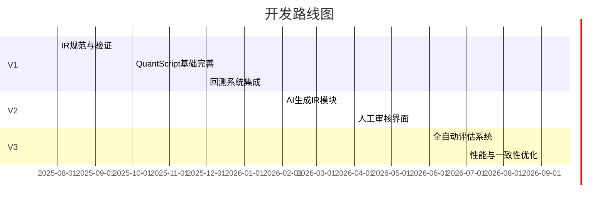

# 系统演化指引报告（基于论文→IR→QuantScript→QRPC流程）

**执行摘要：** 本报告分析“论文→IR→QuantScript→QRPC”策略开发流程并提出系统演化方案。结论：引入结构化IR层并严格验证，构建论文测试集，完善数据源、执行模型和风控语义。优先建议：先实现表达和执行闭环，再推进风控和自动化（V1→V3）【14†L301-L309】【22†L145-L154】。**假设：**目标市场/资产类别/数据频率均视为无特定约束（多市场、多频率，测试通用性）。

## 系统现状概述  
- **Paper Parser：** 尚在规划阶段，当前无完全自动化的论文解析器。需要处理PDF/文本中的策略描述、数学公式和图表信息，提取成结构化内容。  
- **Strategy IR：** 已有“意图→DSL”理念（隐式存在），但尚无最终确定的IR格式。设计理念参照编译器IR，将策略逻辑、信号和风险结构化【14†L301-L309】；现有示例包括策略信号（如MA交叉）、风险规则、数据需求等。  
- **QuantScript生成器：** 已实现基础脚本生成（DSL到量化脚本），可执行简单规则。目前功能有限，需扩充更复杂语法。  
- **QRPC执行链：** 已搭建主干流程（数据归一化→策略意图→Agent推理→风险校验→执行），可完成回测和实盘下单。现有模块包括意图引擎和执行管理。监控日志功能部分到位。  
- **数据协议：** 当前仅支持基础K线数据（分钟级或日线）。缺少多频率、逐笔、限价档位、财务指标等数据源。  
- **风控系统：** 具备全局风险管理（如最大仓位限制、止损触发）。如同文献所述，风控模块能实时监控交易并在触及阈值时暂停交易【34†L84-L90】。但现有语义较简单，缺乏动态头寸管理、资金曲线保护等高级功能。  

## 论文驱动的Gap分类方法  
为结构化识别论文提出的需求，定义Gap类型并制定判定规则：

| Gap类型    | 定义                                    | 示例                                      | 判定规则                           |
|-----------|-----------------------------------------|-------------------------------------------|------------------------------------|
| **EXPRESSION** 表达能力缺失  | 系统IR无法表示论文中的策略逻辑或数学概念              | **横截面因子**：论文需要跨资产排名，但IR无多标的上下文          | 若IR字段或节点无法描述文中逻辑，标记此类Gap   |
| **DATA** 数据能力缺失       | 所需数据类型或频率不在系统支持范围                    | **档位/委托簿数据**：论文依赖撮合或委托量信息，但数据协议不支持 | 若论文依赖的数据（如逐笔/限价档、外部事件）系统不具备   |
| **EXECUTION** 执行模型缺失  | 缺少满足论文假设的交易执行模型（滑点、成交量、延迟等）      | **无滑点假设**：回测假定瞬时成交，现实需考虑滑点模型     | 若论文回测假设与系统执行模型差异大，标记该类Gap  |
| **RISK** 风控语义缺失       | 论文未含仓位/风控设计，需要系统自动补充风险限制             | **无仓位管理**：论文只提信号，未提止损，系统需自动补           | 若策略输出无风控限制，系统需填充（止损、资金管理）    |
| **OTHER** 其他             | 包括性能、监控、可维护性等非功能需求                    | **并行性能**：论文忽略多策略并发需求                             | 不属于上述四类的需求，如系统性能或用户交互等         |

每次处理新论文，应对照上述Gap分类表判断该论文是否提出了系统不具备的要素，如有则加入Gap需求池。  

## 论文测试集设计  
为了评估系统能力，需构建多样化策略论文测试集，建议覆盖主要策略类型。下表给出分类维度及示例论文（可依据实际查阅学术文献）：

| 策略分类      | 特征与考察要点                            | 建议样本数量 | 示例论文（或题目）               |
|-------------|------------------------------------------|------------|-------------------------------|
| 趋势跟踪 (Trend)    | 移动平均交叉、动量或突破策略                 | 5-10       | 如《均线交叉动量策略研究》           |
| 统计套利 (Stat Arb) | 对冲交易、配对交易                           | 3-5        | Gate 等（2006）《Pairs Trading》 |
| 高频微结构 (HFT)   | 委托簿变化、拆分订单、流动性事件                | 2-4        | *Order Book Imbalance* 论文       |
| 因子/横截面 (Factor/Cross) | 跨标的排序、多因子选股（如市值、财务因子）       | 5-8        | Fama-French 因子模型等         |
| 事件驱动 (Event)   | 基于新闻、公告或宏观事件的策略                   | 2-4        | *Earnings Surprise* 研究         |

- **优先支持**：建议先实现简单明确的策略，如均线动量、对冲套利、主流股票因子等；高频和事件策略可作为进阶目标。  
- **样本规模**：每类10篇左右，涵盖不同市场和频率，保证测试集多样全面。  

## Strategy IR 规范草案要点  
策略中间表示（IR）需满足可验证性和可执行性，核心要素包括（示例以JSON结构示意）：  

- **signals/indicators**：信号定义列表。每个信号包含名称、类型（如MA、RSI）、参数（周期等）。  
- **logic/execution**：买卖逻辑，可用条件表达式或逻辑组合（如“ema20 > ema50”）。  
- **risk_rules**：风险控制规则，如最大仓位比率、单笔止损、最大交易频率等。  
- **data_requirements**：所需数据清单，包括标的、数据类型（K线、tick、财务数据）、粒度、回溯窗口等。  
- **其他属性**：如取样频率、回测时间段、资金规模等。  
- **unknown处理**：对于论文中不明确或超出范围的部分，字段值设为`"unknown"`，以提示后续人工确认。  

以上字段可用JSON Schema或Rust结构体形式定义，实现**强类型校验**【36†L347-L354】。例如（示意）：  

```json
{
  "signals": [
    {"id": "momentum", "type": "MA_CROSS", "params": {"fast":20, "slow":50}}
  ],
  "logic": {"condition": "momentum > 0.5"},
  "risk_rules": {"max_position": 0.2, "stop_loss": 0.02},
  "data_requirements": [
    {"symbol": "ANY", "type": "kline", "granularity": "1m", "window": 100}
  ]
}
```

表1展示了部分字段及校验规则示例：  

| 字段            | 类型/格式      | 说明                              | 备注           |
|---------------|--------------|---------------------------------|--------------|
| `signals`     | 列表，JSON    | 策略使用的信号或指标定义                 | 每个元素含`id/type/params` |
| `logic`       | 对象/表达式   | 买卖逻辑的条件表达式或组合                 | 可用逻辑运算和参考信号 |
| `risk_rules`  | 对象         | 风险约束设置                         | 如`max_position`, `stop_loss` |
| `data_requirements` | 列表        | 数据需求列表                         | 包含标的、周期等  |
| 其他元数据      | 对象/字符串   | 频率、回测周期等                      | 视需求定制      |

> **提示：** IR应由JSON Schema或类似格式严格约束，Schema作为“单一真实来源”定义所有可用元素及规则【36†L347-L354】。  

## IR→QuantScript转换要求与提示词模板  
为了保证从IR到量化脚本的转换准确可控，应使用明确的提示词指导LLM生成。示例Prompt设计：  

- **Prompt1（论文→IR）**：指导模型提取论文策略结构，不直接输出代码。  
  ```text
  你是量化策略结构解析器。
  目标：将论文内容转为Strategy IR JSON。

  要求：
  1. 输出纯JSON格式结构，不生成任何可执行代码。
  2. 所有信号指标必须为系统支持的已知类型。
  3. 数据需求映射为系统协议支持的数据类型。
  4. 不清楚的内容用 "unknown" 占位。
  ```
- **Prompt2（IR→QuantScript）**：将验证过的IR转换为可执行脚本。  
  ```text
  你是QuantScript编译器。
  输入：经过验证的Strategy IR JSON。
  输出：符合语言规范的QuantScript代码。

  要求：
  1. 严格遵守QuantScript语法规范。
  2. 不允许访问外部网络或数据源。
  3. 所有变量类型需明确声明。
  4. 逻辑必须可执行，且包含必要风控和执行设置。
  ```

上述Prompt模板需与IR字段同步更新【14†L301-L309】。  

## 必须补充的系统能力清单（按优先级）  
1. **数据源扩展**：支持多级别K线（秒级、tick）、多标的与多市场数据、财务/事件数据。  
2. **执行模型**：引入滑点和流动性模型（如成交概率、撮合延迟），模拟更接近实盘的执行环境【22†L145-L154】【22†L164-L172】。  
3. **风控语义**：丰富仓位管理、动态头寸控制、杠杆限制等语义；支持可配置的止盈止损和资金分配规则。  
4. **指标白名单**：建立指标和因子白名单（如MA、RSI、MACD等常见技术指标），防止AI生成系统不支持的指标。  
5. **监控与日志**：完善实时监控、告警和日志系统，对策略执行过程、性能指标等多维度监控。  
6. **回测/实盘一致性**：建立校准机制，将实盘成本（滑点、手续费、延迟）反馈到回测模型中，并定期对比回测结果与实盘表现。  

以上能力将逐步纳入系统，以填补Gap分类中暴露的不足。  

## Gap→Feature映射与优先级算法建议  
将Gap分类与解决特性对应：例如，对于**数据缺失**的Gap（如无撮合档数据），建议功能特性“接入档位数据源”；对于**表达缺失**的Gap（如缺乏多标的支持），建议“添加跨标的指标/策略模块”。可采用加权打分法评估优先级，评分维度包括：**影响度**（Gap在多少策略中出现）、**开发成本**、**业务价值**。示例：  

| Gap 类型    | 示例                    | 建议特性         | 影响度(1-10) | 开发成本(1-10) | 优先级评分 |
|-----------|-----------------------|---------------|------------|-------------|----------|
| DATA      | 高频撮合档不存在           | 支持Level2深度数据   | 8          | 6           | 14 (高)   |
| EXPRESSION| 无横截面排序能力          | 多标的因子框架     | 7          | 4           | 11 (中高) |
| EXECUTION | 缺少滑点模型             | 增加滑点/延迟模拟    | 9          | 5           | 14 (高)   |
| RISK      | 无动态头寸管理           | 仓位动态调整模块   | 6          | 3           | 9  (中)   |

**建议：**对Gap映射特性进行评分，并优先开发高分项（高影响度、较低成本）。  

## 最小可行实现路线图  
### V1（基础可运行）  
- **交付物**：仅支持K线数据、固定指标（如MA、RSI）、基本买卖规则的策略。量化脚本手动编写、自动回测集成。  
- **验收标准**：能成功转化基本IR（手动构建）、生成QuantScript，并在回测环境跑通策略。  
- **优先级**：高。建立可执行闭环，验证系统框架可行性。  

### V2（半自动化）  
- **交付物**：接入LLM辅助生成IR、并提供人类审核流程。完成Prompt1→IR半自动化，QuantScript自动生成。  
- **验收标准**：AI生成IR正确率（需人工修正少量错误），能够用新策略跑通回测，差错率显著降低。  
- **优先级**：中高。解放人工解析阶段，提高开发效率。  

### V3（全自动化）  
- **交付物**：全流程自动化（论文输入→IR→脚本→回测→自动评估）。新增一致性评分机制，将实盘结果反馈至回测优化。  
- **验收标准**：流程无需人工干预，定期自动评估新策略收益表现，监控指标稳定；回测结果与实盘表现差异控制在可接受范围。  
- **优先级**：中。实现真正的自动化，但需首先打牢V1/V2基础。  

以下Mermaid甘特图示意各阶段里程碑及时间安排：  



## 风险与限制说明  
- **AI误解与幻觉**：LLM可能误解论文描述或生成不存在的指标，因此需要多层验证（结构校验、人工评审）避免错误策略投入执行。  
- **论文不完整或过拟合**：学术文献中的策略往往假设过于理想（例如未考虑滑点或未来数据），实际应用可能不适用；系统需预留 `unknown` 并由专家补充假设。  
- **盈利不可保证**：自动生成的策略仅保证**可执行性**，不保证盈利。策略效果仍需通过严格回测和风控验证，真实市场条件下收益可能与论文报告差异较大。  

## 建议的度量指标与监控方案  
- **表达覆盖率**：能够成功从论文生成IR并表达的策略占比（例如IR字段完整率）。  
- **IR校验率**：AI生成IR初稿通过JSON Schema验证的比例。  
- **执行一致性**：回测结果与实盘结果的偏差度量（如Sharpe比率或收益差异）。  
- **系统完成度**：支持的策略类型/特性的覆盖度，如测试集内论文成功率。  
- **运行性能指标**：策略编译及回测时间，系统吞吐量等。  
- **监控方案**：建立监控仪表盘实时跟踪这些指标，并设置告警（如执行错误、延迟异常）。同时保存完整日志以支持事后分析。  

以上指标用于持续评估系统演化效果和整体成熟度。系统应定期检查这些指标并迭代优化。【22†L145-L154】【22†L164-L172】等资料表明，不考虑交易成本和滑点会导致回测与实盘结果严重不符，因此“一致性”指标尤其关键。 

