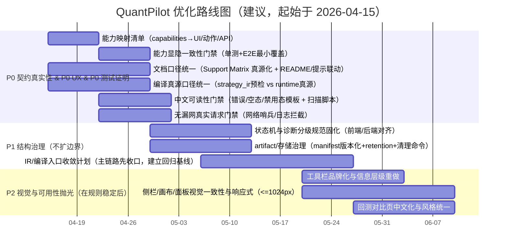

# QuantPilot 优化深度研究总报告

## 执行摘要

本报告以你提供的两份材料为“项目事实基线”：**已完成功能清单（已完成事项优化报告）**与**待优化清单**，在“不新增后端业务能力、不扩产品边界”的约束下，对 QuantPilot 的**真实能力边界、已完成能力成熟度、设计指标兑现差距、测试体系差距、前端体验差距、文档与契约一致性差距**做系统审视，并给出按严重度排序的风险清单、P0/P1/P2 路线图、可落地任务拆解与逐项验收标准。

结论高度收敛为四句话：

1) **P0 的核心不是“再加功能”，而是“把‘capabilities 作为唯一真源’的契约真实性，做到 UI/文档/测试三方一致，且任何用户可达路径都不会触发后端必失败组合”。**（这是当前最重的信任风险面。）

2) **P0 用户体验的核心不是“更好看”，而是“可理解、可行动、可预测”：所有禁用态给原因、所有失败给结构化诊断与下一步、所有列表/筛选/状态切换可预期。**

3) **P0 测试完整性的核心不是“加更多 E2E”，而是“补三道门禁”：能力显隐一致性门禁、中文错误可读性门禁、前端无真实后端漏网请求门禁；并保持 E2E 的隔离与确定性（deterministic）。**E2E 需要遵循“只测你能控制的部分”的原则，避免第三方/外部依赖造成脆弱与漂移。citeturn0search1turn2search0

4) **P1 结构治理的核心是“把已经存在的编译/工件/存储/状态机约束固化为可验证的工程规则”，而不是再讨论抽象架构图。**

本报告的“重要输出”是：  
- 一张“能力成熟度表”（严格区分：已完成 / 已完成但需优化 / 未完成且不能对外宣称）  
- 一张“测试差距表”（覆盖缺口与门禁脚本）  
- 一张“风险清单”（按严重度排序）  
- 一张“P0/P1/P2 路线图（Mermaid）”  
- 一张“任务拆解表”（每项含：章节归属、优先级、粗估时、依赖、验收标准、负责人建议）

## 方法与证据基线

### 证据优先级与边界

- **项目内证据（最高优先级）**：你提供的“已完成功能清单/已完成事项优化报告”（本次对话上传文本）与“待优化清单”（本次对话粘贴）。  
- **外部证据（仅用于通用工程实践，不用于推断你项目现状）**：引用权威工程/测试最佳实践来支撑“为什么要这么做”，而不是用外部资料替代项目事实。涉及：  
  - E2E 隔离与避免第三方依赖（Playwright Best Practices）。citeturn0search1turn2search0  
  - Feature Flags/功能开关带来的组合复杂度与治理成本（entity["people","Martin Fowler","software author"]）。citeturn0search2turn3search1  
  - 测试分层/测试等级术语与退出准则（entity["organization","ISTQB","software testing board"]）。citeturn1search2turn1search4  
  - Small/Medium/Large 测试与“大测试更易脆弱”的经验（entity["company","Google","tech company"] Testing Blog）。citeturn1search0turn1search9  
  - 契约测试概念（Pact 官方文档）。citeturn0search0  

### 未指定项与工程假设

你要求“若某项细节未在材料中明确，标注为‘未指定’并给出合理工程假设”。因此本报告对以下信息视为未指定：  
- 四份 md 设计/实现文档的**逐段原文**与版本号（你在需求中列出文件名，但本次对话未提供其内容全文）。  
- 具体团队成员名单与职责分配（因此所有负责人均按“角色（未指定）”给建议）。  
- CI 平台（GitHub Actions / GitLab CI / Jenkins 等）、发布方式、环境划分（dev/staging/prod）。  

合理工程假设（用于可执行性，不用于夸大现状）：  
- 你们希望在 P0 阶段把系统定位为“**单机/本地可复现的 paper/runtime beta**”，并保持所有测试可在 CI 内 deterministic 运行。  
- 当前的“capabilities”属于**permissioning toggle / release toggle**混合形态（对用户可见能力与发布阶段控制），其治理重点是“单一真源 + 可观测 + 可测试”，否则很容易出现组合爆炸与漏网入口。citeturn0search2turn3search1  

## 能力边界与成熟度

### 当前项目真实能力边界判断

基于你提供的已完成事项清单与待优化清单，可以对外“真实且可验证地”描述的能力边界，应收敛为下面三层（每一层都要在 UI、文档、测试里保持同口径）：

**可对外宣称“已支持”（但仍需用 beta/基础能力措辞）**  
- 图形化策略编辑：图编辑、模块侧栏、属性面板、工具栏动作（Compile/Run/Backtest/导出等）构成完整主路径。  
- 编译主链路：图 → runtime compile（以 runtime compile 为运行真源），并具备结构化 diagnostics 接入前端显示。  
- 运行与回放：paper simulation、运行状态机（idle/running/completed/error/stopped 等）、SSE 事件流订阅与历史回读。  
- 基础回测：可跑、可存、可看、可对比（但必须明确是“基础回测/工程回放”，不是研究级回测）。  
- 测试现状：Rust/前端单测/Playwright E2E/UTF-8 与用户可见文案门禁均通过（但仍需补 P0 三门禁的“增强版覆盖”）。

**已完成但必须“降噪表述/加免责声明”的能力（对外不可超卖）**  
- QuantScript：可导出、可编辑、存在 formal compile 与基础分析，但**不是通用研究语言**，更不是“任何 paper strategy 都可直接用 QuantScript 完整表达”。  
- Custom/受限表达：存在受限路径，但不是插件生态、不允许绕过风控与执行边界。  
- Spread、arbitrage 等：存在编译/Lowering 路径或模块定义，但还不具备“产品级可承诺语义”，对外不得宣传成熟、完备或正式支持（你在清单中已明确这一点）。

**未完成且不能对外宣称支持（必须隐藏或标为不可用）**  
- 研究级回测语义  
- 真套利（true arbitrage）正式能力  
- 多品种/多市场/live trading 正式能力  
- 插件生态与第三方安装面  
- “真正统一到单一 Core IR 的全链路”、typed HIR QuantScript 等 P1/P2 研发路线项（可做内部治理，但不能当作已完成能力）

这里的 P0 契约真实性要求非常明确：**任何用户可达路径都不允许触发“后端必失败”的组合；所有显隐、按钮可用性、模块暴露必须只依赖后端 capabilities 真源。**这类能力门控属于“permissioning toggle”范畴，若缺乏一致性测试，很容易出现组合复杂度与漏网入口。citeturn0search2turn3search1  

### 已完成能力的成熟度评估

评分口径（0–5）：0=无实现；1=仅原型/编译级痕迹；2=可跑但不可对外承诺语义；3=主链路可用但需明显优化；4=稳定可用（beta 级），文档/测试/UX 基本对齐；5=高成熟度（当前阶段不追求）。

| 能力项 | 当前状态 | 成熟度(0-5) | 主要缺陷（聚焦P0/P1） | 建议修复动作（不扩边界） | 验收标准（可测/可审计） |
|---|---|---:|---|---|---|
| 策略图编辑器（画布/节点/连线/保存/恢复） | 已完成但需优化 | 3 | 选中态/错误态/运行高亮态视觉统一不足；密度与留白影响可读性 | 统一节点状态视觉规范（idle/selected/error/running），建立样式 token；补“诊断定位→画布聚焦”闭环 | 在同一张复杂图上：能 3 秒内定位到错误节点；selected/error/running 三态对比明显；Playwright 覆盖“错误定位→自动聚焦” |
| 模块侧栏（分类/搜索/capability 显隐） | 已完成但需优化 | 4 | 分类识别度不足；禁用态解释不精致；可能存在漏网入口风险 | 侧栏卡片分组节奏；统一“不可用原因”呈现；引入“能力显隐一致性门禁” | 给定 capabilities fixture：侧栏模块集合与映射清单完全一致；禁用项必须展示原因（tooltip/inline） |
| 属性面板（配置/状态/编译结果/脚本编辑） | 已完成但需优化 | 3 | 信息架构偏工程工具；分区不清晰导致学习成本高 | 重做 IA：配置/运行状态/编译结果/脚本编辑四分区；错误/警告分级 | 新手任务测试：完成“修复一个编译错误并重新 compile”所需点击次数下降；所有错误条目均提供“定位/建议修复” |
| 顶部工具栏（状态胶囊/动作区） | 已完成但需优化 | 3 | 状态提示密度与文案不一致；禁用原因表达不足 | 统一标题/副标题/状态胶囊/动作区密度；所有锁按钮给原因 | 任一被锁按钮 hover/点击均给出不可用原因；capabilities fallback 时高风险动作不可达且解释清楚 |
| 图校验（is_valid / is_runnable 与 diagnostics） | 已完成但需优化 | 4 | 错误分级与“下一步动作”提示不够明确 | 建立诊断分级（blocker/warn/info）与动作模板（修复/忽略/查看文档） | 每条 blocker 都有可行动建议；前端可按分级过滤；E2E 覆盖 blocker 阻断 compile 路径 |
| Compile 主链路（runtime compile 为真源） | 已完成但需优化 | 4 | “strategy_ir 预检 vs runtime compile 真源”口径需在 UI/文档/测试完全统一 | 在所有 UI 文案与 README/roadmap/测试期望中统一口径；在 summary 明确标注“预检/真源” | 任一页面不出现矛盾描述；当 strategy_ir 通过但 runtime compile 失败时，UI 明确展示“以 runtime 为准”并给出诊断 |
| Strategy IR（编辑/编译/诊断映射） | 已完成但需优化 | 4 | 用户可读性不足；错误解释需要“面向用户的翻译层” | 增加“常见错误解释字典”；提供最小示例与边界说明 | 诊断信息中文可读且无乱码；80%常见错误能给出“原因+修复建议” |
| QuantScript（导出/编辑/formal compile） | 已完成但需优化 | 3 | 易被误解为“研究语言”；表达边界需反复压实 | UI/文档添加“受限边界说明”；禁用超边界入口 | 任一导出/编辑处都提示边界；不出现“任何策略都能表达”的暗示性文案 |
| Core IR / Lowering（已有但未全链路统一） | 已完成但需优化 | 3 | 全链路统一到单一 Core IR 未完成（不能对外宣称）；内部语义可能分岔 | 作为 P1 治理：梳理入口→IR→artifact 统一路线；补回归基线 | 入口收敛计划形成；至少 1 条主链路完成“同一 IR 真源”回归测试；对外文案不宣称已统一 |
| 模拟运行（paper run + 状态机） | 已完成但需优化 | 3 | SSE 断线重连/Last-Event-ID 等完整语义未作为正式能力兑现（属于体验风险） | P0 仅做“体验兜底”：断线提示+一键重连+从历史加载；P1 再完善协议语义 | 断线可恢复（用户可理解路径）；不会出现“静默不更新”的假运行态 |
| 运行事件流（过滤/搜索/联动高亮） | 已完成但需优化 | 3 | 噪音较高、密集信息不可扫读；长列表体验可改进 | 事件摘要模板化；状态标签与关键数字对齐；虚拟列表/分页策略 | 事件面板支持“摘要模式/详情模式”；关键字段一屏可扫读；回归测试覆盖过滤/搜索/联动 |
| 回测（工件产出/存储/查看/历史/对比） | 已完成但需优化 | 3 | 必须持续明确为“基础回测/工程回放”；对比页风格偏工程页 | 文案全部降噪；对比页中文化与视觉统一；工件优先策略固化 | 文档与 UI 无“研究级回测”暗示；对比页信息结构一致；回测详情以 artifact-first 展示 |
| 后端 API 覆盖（capabilities/compile/run/backtest/graphs 等） | 已完成 | 4 | 需要契约层保障“文档↔实现↔前端调用”长期一致 | 增加 API 契约测试（schema/样例对齐）；把“禁止漏网真实请求”纳入门禁 | 任一 API 变更必须更新契约与前端；CI 可阻断破坏性变更（契约不一致即失败）citeturn0search0turn3search0 |
| 图与运行记录持久化（artifact 目录存在） | 已完成但需优化 | 4 | 清理策略/保留策略未指定；长期可能引发磁盘与可维护性风险 | P1：定义 retention policy、artifact manifest 版本化；提供清理命令 | 有明确保留策略与默认值；可一键清理；不会误删引用中的 backtest/run |
| 数据/意图/风控/执行/runtime control 模块主链 | 已完成但需优化 | 4 | 需要把“主链路约束”固化成编译期/运行期可验证规则（治理项） | P1：定义链路契约（允许的边/组合）；编译器拒绝非法图 | 对任意非法组合：compile 必然失败且给出明确诊断；合法组合：主链路最小图可一键跑通 |
| 代理模块（含 arbitrage 痕迹） | 未完成（不能宣称） | 1 | 存在“代码痕迹/编译路径”但不构成可对外承诺的产品能力 | P0：隐藏或标注不可用；P1：仅内部 refactor，不对外宣称 | UI 中不存在“正常操作路径”可触发该能力；文档不宣称；测试覆盖“不可达/不可用” |

## 差距分析

### 设计指标兑现差距分析

以下差距以你提供的“设计指标兑现项（P0）”为主线，并从**产品/架构/前端/测试/文档/工程治理**六维度给出差距与落点。

**产品维度（契约真实性优先）**  
现状已具备可跑通的主链路（编辑→编译→运行/回测→历史/工件），但产品层最大的差距不是功能，而是“**可承诺语义**”：哪些是已支持、哪些只是痕迹、哪些必须隐藏。你的清单已明确“不能超卖”，这等价于把“承诺面”当作第一产品功能。若承诺面不一致，任何演示成功都只是偶然，口碑风险极高。

**架构维度（capabilities 单一真源的工程化）**  
你已把 capabilities 作为后端真源，并在前端显隐、按钮可用性上跟随。但差距在于：  
- **真源需要“可证明”：**必须把“能力→UI 元素→API 调用路径”的映射固化为机器可检查的清单/契约，否则迟早出现漏网入口。  
- **编译真源需要“可解释”：**“strategy_ir 预检 vs runtime compile 真源”需要在所有触点统一，否则会产生“明明通过预检却跑不起来”的信任裂缝（尤其是对非工程用户）。

**前端维度（表达“真实状态”的能力）**  
P0 UX 的关键差距集中在三处：  
- **禁用态只变灰不解释**会直接损害“可理解性”；这在能力门控系统里尤其致命，因为用户必须知道“我为什么不能点、要怎样才能点”。  
- **失败提示不结构化**会让 compile/run/backtest 成为“黑箱”，用户只能重试，形成“平台不可靠”的主观印象。  
- **状态机表达不强**（idle/running/completed/error）会导致误操作与重复触发。

**测试维度（从“通过”升级到“证明”）**  
当前“通过”的测试更像“回归健康度”，下一步要变成“契约证明”。这意味着新增的不是更多 E2E，而是更强的门禁：  
- 能力显隐一致性（capabilities→UI）  
- 中文可读性（错误/空态/禁用态）  
- 前端无真实后端漏网请求（尤其 Vite proxy 拒连类日志）  
同时，E2E 应坚持“尽可能隔离”与“避免第三方依赖”的原则，否则套件会迅速变大且脆弱。citeturn0search1turn2search0  

**文档维度（README/roadmap/提示文案/测试期望统一）**  
差距不是“写得少”，而是“同一件事不同地方写法不一致”，直接造成对外承诺漂移。此类漂移必须被当作缺陷对待，并被门禁脚本阻断（例如：出现“研究级回测”等词就 fail）。  
同时，所有用户可见文本要维持 UTF-8 可读，不只是“无乱码”，而是“中文表达像产品，不像日志”。

**工程治理维度（把规则写成可执行的制度）**  
你已经有门禁脚本与测试通过，这是非常关键的基础。差距在于：哪些门禁是“习惯”，哪些是“制度”。P0 阶段要把 gate 变成 CI 的硬规则，P1 阶段再把“能力映射、文案词表、工件规范、清理策略、状态机规范”变成项目治理文档+自动化检查。

### 测试体系差距分析

下面表格把现状与缺口按“P0 契约真实性 / P0 UX 可理解性 / P0 测试确定性 / P1 治理”四类聚合。测试分层术语可参考 entity["organization","ISTQB","software testing board"] 的测试等级定义（组件/集成/系统/验收）citeturn1search2turn1search4，以及 entity["company","Google","tech company"] 对 Small/Medium/Large 测试与“更大测试更易脆弱”的经验（Large tests 更易 flaky）。citeturn1search0turn1search9  

| 测试类型/层级 | 当前覆盖情况（来自你提供材料） | 主要缺口 | 优先级 | 建议用例/门禁脚本（可落地） |
|---|---|---|---|---|
| Rust 单测/服务级测试（Small/Medium） | 已覆盖 capability、compile、run、backtest、SSE 等主 API | 缺少“契约层”约束（schema/样例/版本变更） | P0 | 为 /api/capabilities 与关键响应增加 JSON Schema/OpenAPI 级校验；把“文档↔实现不一致”视为 CI fail（契约测试思想可参考 Pact）。citeturn0search0 |
| 前端单测（Vitest/组件/Store） | 已覆盖 capability fallback、compile diagnostics、backtest artifacts、PropertyPanel、DiagnosticsPanel 等 | 缺少“能力显隐一致性”的白盒断言（UI 清单对齐） | P0 | 引入映射清单（capability→模块/按钮），单测对给定 capabilities fixture 做快照/集合断言 |
| Playwright E2E（Large） | 已覆盖 P0 主链路与关键拒绝路径；已移除对 formal compile 的真实后端依赖 | 缺少“可理解性断言”（禁用原因/错误行动建议）；失败路径仍可更精炼 | P0 | 新增：禁用按钮必须出现原因；compile/run/backtest 失败必须出现“原因+下一步”结构；保持套件小且隔离，避免第三方依赖/不确定数据源。citeturn0search1turn2search0 |
| 无真实外部依赖（deterministic fixtures） | 已明确“E2E 禁止真实外部依赖” | 缺少“漏网请求”自动检测（proxy 拒连日志等） | P0 | 实现“网络哨兵”：E2E 中未被 route/mock 的请求一律 fail；CI 解析日志关键字触发失败 |
| 文案/编码门禁 | 已有 UTF-8 与 user-facing-text 脚本 | 缺少“中文可读性”更强约束（错误、空态、筛选、历史列表） | P0 | 增加词表/黑名单（历史 mojibake / replacement char / 伪中文）；新增“错误模板检查”（必须包含动作提示） |
| 合同/接口一致性（Contract） | 未指定（你提出需要统一 README/roadmap/提示文案/测试） | 文档/提示/测试断言可能发生漂移 | P0 | 建议把“支持边界声明”抽成单文件真源（Support Matrix），再生成 README 片段与 UI 提示；CI 检查一致 |
| 视觉回归（Visual Regression） | 未指定 | UI 重做后易出现无意回退 | P1 | 关键页面（编辑器/回测详情/对比）做截图 diff（仅少量关键视图），防止审美与布局回退 |
| 性能/稳定性（长列表/大图） | 未指定 | 事件流长列表、复杂图编辑可能卡顿 | P1 | 前端性能基线：事件列表虚拟化；大图操作 FPS/响应时间基线；回归比较 |
| 存储与清理（artifact retention） | 未指定清理策略 | 长期运行存在磁盘增长与数据混乱风险 | P1 | 增加“存储清理回归”：保留策略生效、不会误删被引用的 artifact；提供 dry-run |

### 前端体验与审美差距分析

你的“前端美化清单”已经把问题描述得非常准确。这里补充的是：把“审美项”转成**可验收**的体验指标（否则 UI 容易陷入无休止打磨）。

**工具栏（品牌化与信息分层）**  
差距不是颜色/边距，而是“信息层级的可扫读性”：标题/副标题/状态胶囊/动作区需要形成稳定的阅读顺序；状态胶囊要能表达 capabilities sync 状态、runtime 状态与当前图状态，并能在 fallback 时给用户明确解释。

**侧边栏（模块分组识别度与禁用解释）**  
能力门控系统里，侧边栏不只是“模块列表”，还是“能力宣告面”。禁用态必须告诉用户：  
- 被哪个 capability 锁住  
- 为什么锁  
- 需要什么条件才能解锁（若当前阶段永不解锁，则直接说明“暂不支持/不在当前边界”）

**画布区（节点留白/边线对比/状态色）**  
建议把“状态”做成设计系统的一部分：selected/error/running/disabled/hover 五态统一，避免碎片化 CSS。通过视觉减少认知负担，本质是降低“找不到问题位置”的操作成本。

**属性面板与事件流面板（信息架构）**  
面板型产品最怕“所有信息堆一起”。你已明确要把“配置/运行状态/编译结果/脚本编辑”分区拉清楚；建议再加一条可验收原则：**任何诊断信息必须提供“定位入口”**（点击即可聚焦到画布节点/JSON 区/脚本行）。

**回测历史/运行历史/对比页（统一视觉规则）**  
历史卡片与对比页目前“偏工程页”的问题，本质是：信息无排序、无摘要模板、无主指标。建议确定一个“回测主摘要模板”（例如：区间、最终权益、收益、回撤、成交数、数据集、参数哈希、运行/回放源），其余信息折叠到详情。

**响应式（≤1024px 三栏布局）**  
这类问题不应靠“手工调”，而应形成“断点策略+最小可用布局规则”，否则每次新增面板都会破。

### 文档与契约一致性差距分析

P0 文档工作不是“写更多”，而是“让所有描述指向同一真源”，并把它变成自动化可检查。

**差距一：支持/不支持口径分散**  
你明确要求 README、roadmap、前端提示文案、测试用例统一。当前最大风险是：某处文案“暗示研究级回测/多市场/插件”等，造成对外承诺漂移。必须建立“支持矩阵 Support Matrix（真源）”，并从中生成：  
- README/roadmap 片段  
- UI 的 capability/禁用提示  
- 测试断言（例如：当 capability=false 时按钮必须不可用且提示一致）

**差距二：编译优先级口径容易写错**  
“strategy_ir 只是预检，正式运行以 runtime compile 为准”这句话必须出现在所有相关界面与文档，并在发生冲突时（预检通过但 runtime 失败）给出解释与下一步。

**差距三：回测语义必须长期维持“基础回测/工程回放”**  
这不是一句口号，而是所有用户触点都要避免“研究级”“统计显著性”“优化器”等暗示性词汇。建议把禁用词汇、替代说法做成门禁脚本。

**差距四：用户可见文本质量门禁需要从“无乱码”升级到“可读、统一语气”**  
你已在清单里提出“空态/错误态/禁用态/fallback 态统一语气”。建议定义：  
- 错误消息模板（现象→原因→建议动作→如需联系支持的上下文信息）  
- 术语策略（哪些保留英文、哪些给中文解释）  
并让脚本检查“是否包含动作建议”。

## 风险与路线图

### 风险清单（按严重度排序）

严重度定义：S0=对外承诺/可达路径致命破坏（信任与演示风险）；S1=主流程高概率失败或误导；S2=体验显著拖累；S3=治理债务积累。

| 严重度 | 风险 | 触发条件 | 影响 | 优先级 | 建议措施 | 验收标准 | 负责人建议 |
|---:|---|---|---|---|---|---|---|
| S0 | UI 暴露“后端必失败”组合（假入口） | capabilities 与显隐/按钮可用性不一致；或漏网路径绕过门控 | 直接破坏契约真实性；演示/试用崩盘 | P0 | 建立能力映射清单+自动化一致性门禁 | 任一 capability=false 时，所有相关入口不可达且解释一致；CI 自动阻断 | 前端负责人（未指定）+测试架构师（未指定） |
| S0 | 文档/文案超卖（研究级回测/插件/多市场等暗示） | README/roadmap/UI 提示出现越界措辞 | 信任与合规风险；对外预期失控 | P0 | Support Matrix 真源化；禁用词门禁脚本 | 全仓扫描无越界词；UI/README/测试断言一致 | 产品/文档 Owner（未指定） |
| S0 | 编译真源口径不一致导致“通过≠能跑” | strategy_ir 通过但 runtime compile 失败，UI 未解释清楚 | 用户认知崩塌：认为平台不可靠 | P0 | 统一口径+冲突态 UI 解释模板 | 发生冲突时 UI 显示“以 runtime 为准”并给修复建议 | 后端架构师（未指定）+前端负责人（未指定） |
| S1 | E2E/集成测试出现真实外部依赖或不确定数据 | 未 mock 的网络请求、外部服务波动 | CI 脆弱、回归不可信 | P0 | 网络哨兵：未 mock 请求即 fail；固定 fixtures | E2E 100% 可离线/可复现；无漏网请求 | 测试架构师（未指定） |
| S1 | 禁用态无原因、错误不结构化 | 用户看到灰按钮/失败提示像日志 | UX 低可信、支持成本高 | P0 | 统一禁用/错误模板；诊断分级 | 任一失败都给“原因+行动建议”；禁用均可解释 | 前端体验审计师（未指定） |
| S1 | SSE/运行状态表达不足导致误操作 | 断线无提示、状态切换不明显 | 重复触发/误判运行结果 | P0 | 断线提示+一键重连+历史回读兜底 | 断线可恢复且用户理解；状态机一致 | 前端负责人（未指定） |
| S2 | 事件流噪音高、长列表不可扫读 | 高频事件堆叠、字段排版不佳 | 排障效率低 | P1 | 摘要模板化、优先级标签、列表虚拟化 | 关键事件 1 屏内可扫读；滚动不卡顿 | 前端负责人（未指定） |
| S2 | 回测对比页“工程页”风格不统一 | 对比页信息杂乱、中文化不足 | 用户难以做决策比较 | P1 | 统一摘要模板与视觉规范 | 对比页与详情页信息结构一致 | 设计/前端（未指定） |
| S3 | capabilities/开关组合复杂度长期上升 | 增加更多能力与分支后缺少治理 | 维护成本指数化 | P1 | 开关分类治理（release/permissioning），清理机制 | 每个 capability 都有映射、Owner、退役计划 | 工程治理顾问（未指定） |
| S3 | artifact 持久化缺少 retention/版本化 | 长期产生堆积与混乱 | 运维风险、排障困难 | P1 | retention policy + manifest 版本化 + 清理命令 | 可预期保留；可安全清理；可审计 | 后端平台工程（未指定） |

关于“大测试更易脆弱”的经验风险：entity["company","Google","tech company"] 的测试经验显示 Large tests 的 flaky 概率显著更高，因此应避免把 E2E 扩成“大而脆”套件，而用更多 Small/Medium 来证明契约。citeturn1search9turn1search0  

### 优化优先级路线图（P0/P1/P2）

### 建议的执行顺序与依赖关系

执行顺序遵循“先契约后审美、先门禁后扩展测试、先真源后表现层”：

1) **先做能力映射清单**（这是 P0 的“地基”）。没有映射清单，就无法证明“capabilities 是唯一真源”，也无法稳定地扩展 UI 与测试。  
2) **并行推进三道门禁**：显隐一致性、中文可读性、无漏网请求。它们直接把“口径一致”变成“CI 可阻断”。  
3) **再做 UX 模板化**（禁用态原因、错误结构化、诊断分级）。这一步依赖前两步，否则会被反复改。  
4) **P1 再做结构治理**（状态机/工件/存储/IR 收敛）。治理必须以 P0 的“对外契约稳定”为前提，否则治理输出无法验收。  
5) **P2 再做视觉一致性与响应式抛光**，避免“漂亮但不可信”。

## 验收与任务拆解

### 每项优化的验收标准

为避免“优化项无法收口”，建议把验收标准统一成三类（每个任务至少满足其中两类）：

**契约类验收（P0 必备）**  
- **可达路径零假入口**：任何用户可达路径不会触发“后端必失败组合”。  
- **三方一致**：Support Matrix（真源）= UI 提示 = README/roadmap = 测试断言。  
- **capabilities 一致性可证明**：给定 capabilities fixture，UI 的模块集合、按钮 enable/disable、可调用 API 集合可被测试断言完整覆盖。

**体验类验收（P0 必备）**  
- **禁用态可解释**：所有被 capability 锁住的按钮/模块必须展示原因与边界说明。  
- **失败可行动**：compile/run/backtest 任一失败必须给出结构化信息（现象/原因/建议动作/必要上下文）。  
- **状态可预测**：运行态/回测态/筛选态/分页态切换规则一致且可复现。

**工程治理类验收（P1 重点）**  
- **规则可自动化**：任何治理规则都必须落为 lint/test/gate（能在 CI 上跑）。  
- **回归基线**：核心工件（runtime_config、manifest、equity_curve 等）有 deterministic fixture；关键变更可对比。  
- **退役与清理**：长生命周期能力（capabilities、artifacts）有 Owner、版本化、清理策略。

补充：关于 E2E 的验收原则，建议显式采用 Playwright 的隔离与“只测你能控制的部分”原则，避免第三方依赖导致脆弱。citeturn0search1turn2search0  

### 可直接落地的任务拆解表

粗估时以“工程日”为单位（1d≈1人日），仅用于排序与排期；负责人均以“角色（未指定）”给出。

| 任务 | 所属章节 | 优先级 | 估时 | 依赖 | 验收标准 | 负责人建议 |
|---|---|---|---:|---|---|---|
| 建立 Support Matrix 真源文件（支持/不支持/免责声明） | 文档与契约一致性 | P0 | 2d | 无 | README/roadmap/UI 文案全部从该真源生成或对齐；出现越界词 CI fail | 产品/文档 Owner（未指定） |
| capability→UI/按钮/API 映射清单（机器可读） | 契约真实性 | P0 | 2d | 无 | 映射清单覆盖所有模块显隐与主动作按钮；代码引用该映射 | 前端负责人（未指定）+后端架构师（未指定） |
| “能力显隐一致性”单元测试（给定 fixtures 断言 UI 集合） | 测试体系差距 | P0 | 2d | 映射清单 | capabilities fixture 下：侧栏模块集合/按钮 enable 状态与映射一致 | 测试架构师（未指定） |
| “禁用态必须解释原因”UI 规范与组件封装 | 前端体验 | P0 | 2d | 映射清单 | 任一 disable 均展示原因（tooltip/inline）；E2E 断言存在 | 前端体验审计师（未指定） |
| “中文错误/空态/禁用态”文案模板库 + 词表 | 文案与编码 | P0 | 2d | Support Matrix | 错误模板包含“原因+建议动作”；术语策略落地并可扫描 | 产品/文档 Owner（未指定） |
| 中文可读性门禁脚本增强（覆盖错误、按钮、空态、筛选、历史列表） | 测试体系差距 | P0 | 2d | 文案模板库 | 扫描命中历史 mojibake/伪中文/替换符即 fail；关键页面文案抽检通过 | 工程治理顾问（未指定） |
| 无漏网真实后端请求门禁（E2E 网络哨兵：未 mock 即 fail） | 测试体系差距 | P0 | 2d | 无 | Playwright 运行期捕获未 route 的请求即失败；CI 日志无 proxy 拒连 | 测试架构师（未指定） |
| compile 真源口径统一：UI/文档/测试断言同步（strategy_ir 预检 vs runtime 真源） | 设计指标兑现差距 | P0 | 2d | Support Matrix | 三处一致；当预检通过但 runtime 失败时，UI 明确解释并给下一步 | 后端架构师（未指定）+前端负责人（未指定） |
| diagnostics 分级（blocker/warn/info）与“下一步动作”规则 | 设计指标兑现差距 | P0 | 3d | 文案模板库 | blocker 必含修复建议；前端可过滤分级；E2E 覆盖 blocker 阻断 | 后端架构师（未指定）+前端体验审计师（未指定） |
| 节点/边/诊断联动增强：点击诊断→画布聚焦→属性面板定位 | 前端体验 | P0 | 3d | diagnostics 分级 | 1 次点击可定位问题；复杂图定位时间显著下降（可做基准） | 前端负责人（未指定） |
| 运行状态表达兜底：断线提示、一键重连、从历史回读入口 | 前端体验 | P0 | 3d | 无 | 断线不会“静默”；用户可恢复；状态机显示一致 | 前端负责人（未指定） |
| 筛选器“一键重置”与列表状态一致性（选中项/过滤/分页） | 前端体验 | P0 | 2d | 无 | 任一列表页具备 reset；分页与过滤规则一致且可复现 | 前端负责人（未指定） |
| 回测/运行历史卡片摘要模板统一（主指标优先） | 前端体验与审美 | P1 | 3d | Support Matrix | 历史卡片遵循同一摘要结构；对比页信息结构对齐 | 前端体验审计师（未指定） |
| 事件流降噪：摘要模式/详情模式 + 关键字段排版规则 | 前端体验 | P1 | 3d | 无 | 摘要模式一屏可扫读；过滤/搜索/联动不退化 | 前端负责人（未指定） |
| 回测对比页中文化与风格统一（从工程页→产品页） | 前端体验与审美 | P1 | 3d | 摘要模板 | 术语统一、布局一致、无英文碎片（按术语策略） | 设计/前端（未指定） |
| artifact 治理：manifest 版本化 + retention policy + 清理命令 | 工程治理 | P1 | 5d | 无 | 有默认保留策略；可 dry-run 清理；可审计不误删 | 后端平台工程（未指定） |
| capabilities 治理：分类（release/permissioning）+ owner + 退役机制 | 工程治理 | P1 | 3d | Support Matrix | 每个 capability 有 owner、用途、退役计划；减少组合爆炸风险 | 工程治理顾问（未指定）citeturn3search1turn0search2 |
| IR/编译入口收敛计划（主链路先统一，建立回归基线） | 结构治理 | P1 | 5d | diagnostics 分级 | 至少 1 条主链路完成“同一 IR/工件真源”回归；对外文案不宣称已统一 | 后端架构师（未指定） |
| 编辑器视觉二轮抛光（节点留白/边线/选中态/错误态/运行高亮态） | 前端体验与审美 | P2 | 5d | 状态规范 | 五态视觉规范落地；不引入破坏性交互回退；关键视图截图对齐 | 设计/前端（未指定） |
| 响应式布局（<=1024px 工具栏/三栏/事件区高度）策略固化 | 前端体验与审美 | P2 | 5d | IA 改造 | 定义断点规则；新增面板不破布局；关键断点截图回归 | 前端负责人（未指定） |
| 视觉回归最小集（编辑器/回测详情/对比） | 测试体系差距 | P2 | 3d | 视觉规范稳定 | 关键页面截图 diff 纳入 CI；误差阈值明确；减少“越改越乱” | 测试架构师（未指定） |

关于契约测试：Pact 官方文档对“契约测试用于在不部署整套系统的情况下验证交互点一致性”的定义，可用来解释为什么要做“capabilities/UI/API 映射契约化”这类工作。citeturn0search0