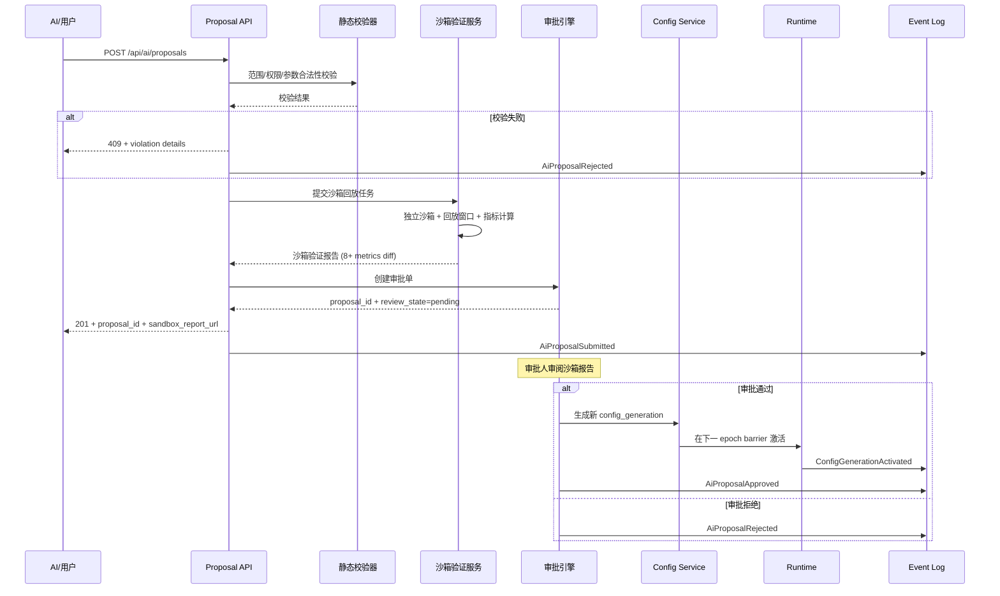
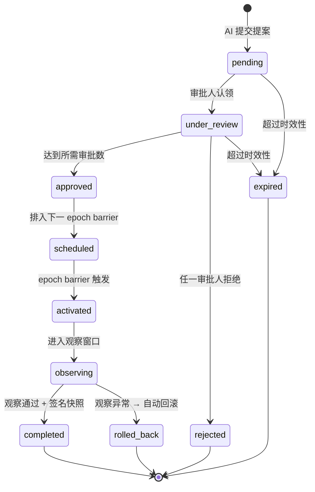

# Block 5 — AI 安全入口与全面运维化实现细则

## 执行摘要

Block 5（里程碑 E）是 v0.2.0 第二阶段最后一块拼图。它的核心命题不是"让 AI 替代人交易"，而是**在 Block A–D 已经建立的版本基座、事件总线、时间轴、安全窗口和策略合并能力之上，补出一个受控的 AI 参与入口和一套完整的运营闭环**。

本次研究的五条核心结论：

第一，**AI 是建议者，不是执行者**。AI 只能产出候选变更（参数、模块配置、合并权重），所有变更必须经过静态校验 → 沙箱回放 → 模拟盘验证 → 人工审批 → 灰度激活的完整链路后方可生效。任何绕过审批直接推送 live 的路径必须在框架层面被阻断。

第二，**沙箱验证必须闭环比对**。AI 提交的每一份候选变更，都必须在独立沙箱中完成至少一个完整回放窗口的验证，产出可对比的 metrics diff（收益率、最大回撤、夏普比率、胜率、平均持仓时间），并与当前已激活版本并排呈现给审批人。

第三，**审批流不是简单的"同意/拒绝"**。它必须同时承载：变更范围说明、沙箱验证结果摘要、影响链路节点标记、回滚预案、审批链和时效性约束。参数级变更可单人审批，模块级变更需双人审批，风控参数变更需风控负责人审批。

第四，**全面运维化 = 告警 + 报表 + runbook + 混沌**。告警以"稳态指标"为核心（数据新鲜度、事件完整性、风控异常率、回放一致性），不追求 Dashboard 漂亮；报表按 ops / audit / research 三档输出，分别面向值班、审计和研究三类角色；runbook 覆盖至少 6 类已知故障场景；混沌实验按季度执行并归档。

第五，**签名快照是回滚的最后防线**。每次 deployment_revision 激活时生成签名快照（capability_hash + strategy_version + parameter_version + core_ir_digest + event_slice_bounds），存储于独立于运行时的快照存储中，支持一键恢复。

---

## 目标范围与边界

### 纳入 Block 5 的能力

| 能力 | 简短定义 | 纳入边界 | 明确不包含 |
|---|---|---|---|
| AI 参数提案 | AI 基于历史回测与当前运行状态提交参数变更建议 | 仅提交候选、不直接激活；必须附带回放验证结果 | 不包含 AI 实时自主调参 |
| AI 模块配置提案 | AI 提交候选模块配置（如新增 Intent、调整 Agent 权重） | 仅提交候选、不直接替换；必须通过 shadow replay | 不包含 AI 生成新模块代码 |
| 审批流引擎 | 参数/模块/合并方案的审批链管理 | 支持单人审/双人审/风控负责人审三级；时效性自动降级 | 不包含外部 IM/邮件审批集成 |
| 沙箱验证服务 | 在独立沙箱中回放 AI 提案并产出对比报告 | 至少一个完整回放窗口；产出 8+ 指标对比 | 不包含分布式并行回放 |
| 告警规则引擎 | 围绕稳态指标的告警触发、抑制、聚合、路由 | 覆盖数据/事件/风控/执行/回放 5 域 | 不包含 ML 异常检测 |
| 运营报表 | ops / audit / research 三档周期性报表 | 日报(ops)、周报(audit)、月报(research) | 不包含自定义 BI 报表 |
| Runbook | 已知故障场景的诊断与恢复手册 | 6 类场景，含诊断步骤、恢复命令、验证标准 | 不包含自动修复 |
| 混沌实验 | 围绕稳态指标的季度扰动验证 | 数据延迟/事件丢失/磁盘压力/时钟偏移 4 类 | 不包含网络分区/多节点故障 |
| 签名快照与恢复 | deployment_revision 激活时的不可变签名快照 | 快照含 5 项版本指纹 + 事件切片边界 | 不包含全量数据备份 |

### Block 5 前置依赖

Block 5 必须建立在 Block A–D 全部完成的基础上，具体依赖关系：

```
Block A (事件与版本基座) ──┐
Block B (时间轴与回放) ────┤
Block C (参数流式调整) ────┼──→ Block E (AI安全入口与全面运维化)
Block D (受限热插拔+合并) ─┘
```

没有事件基座，AI 提案无法溯源；没有回放，沙箱验证无法产出对比；没有安全窗口，AI 变更无法在受控边界内激活；没有合并引擎，AI 无法提出跨策略的权重建议。

---

## 架构与接口设计

### AI 变更全生命周期

```
┌─────────────────────────────────────────────────────────┐
│                    AI 变更生命周期                        │
│                                                         │
│  AI提案 → 静态规则校验 → 沙箱回放验证 → 模拟盘验证        │
│     ↓                                              ↓    │
│  [拒绝+审计]←──失败──┤                    ├──失败──→[拒绝+审计]
│                      │                    │              │
│                      ↓                    ↓              │
│                   人工审批 ←──────── 双人/风控负责人审批   │
│                      ↓                                   │
│                   灰度激活 (epoch barrier)                │
│                      ↓                                   │
│                   观察窗口 (默认60s，可配置)               │
│                   ├── 异常 → 自动回滚 + 告警              │
│                   └── 正常 → 全量激活 + 签名快照           │
│                                                         │
│  全链路审计: proposal_id → trace_id → deployment_revision │
└─────────────────────────────────────────────────────────┘
```

### 审批流引擎



### 关键 API 设计

```json
POST /api/v1/ai/proposals
{
  "proposal_id": "ai-prop-20260501-001",
  "source_model": "claude-opus-4-7",
  "prompt_hash": "sha256:a1b2c3...",
  "scope": "parameter",
  "target_strategy_version": "sv_20260428_001",
  "target_deployment_revision": "rev_20260428_007",
  "requested_changes": {
    "params": {
      "ema_fast": 12,
      "ema_slow": 26,
      "risk_budget_bps": 35
    }
  },
  "rationale": "基于过去30日回测，缩短EMA周期可将最大回撤从12%降至8%",
  "risk_impact_self_assessment": {
    "max_drawdown_impact": "reduce",
    "turnover_impact": "neutral",
    "exposure_impact": "neutral"
  }
}
```

```json
GET /api/v1/ai/proposals/{proposal_id}/sandbox-report
{
  "proposal_id": "ai-prop-20260501-001",
  "sandbox_run_id": "sbx-run-20260501-001",
  "replay_window": {
    "from_ts": "2026-04-01T00:00:00Z",
    "to_ts": "2026-04-30T23:59:59Z"
  },
  "baseline_metrics": {
    "total_return_ratio": 0.15,
    "max_drawdown_ratio": 0.12,
    "sharpe_ratio": 1.2,
    "win_rate": 0.55,
    "avg_hold_hours": 48.0,
    "turnover_ratio": 0.30,
    "profit_factor": 1.8,
    "calmar_ratio": 1.25
  },
  "candidate_metrics": {
    "total_return_ratio": 0.18,
    "max_drawdown_ratio": 0.08,
    "sharpe_ratio": 1.5,
    "win_rate": 0.58,
    "avg_hold_hours": 36.0,
    "turnover_ratio": 0.35,
    "profit_factor": 2.1,
    "calmar_ratio": 2.25
  },
  "diffs": {
    "total_return_ratio": "+0.03",
    "max_drawdown_ratio": "-0.04",
    "sharpe_ratio": "+0.30",
    "win_rate": "+0.03",
    "avg_hold_hours": "-12.0h",
    "turnover_ratio": "+0.05",
    "profit_factor": "+0.30",
    "calmar_ratio": "+1.00"
  },
  "verdict": "candidate_outperforms_baseline",
  "warnings": ["turnover 增加 17%，需关注手续费影响"],
  "replay_fidelity": "full"
}
```

---

## 沙箱验证服务

### 架构

沙箱验证服务是 AI 安全的**核心技术闸门**。它在独立于主运行时的沙箱中，使用与主运行时相同的事件切片、相同的能力快照，回放相同的时间窗口，产出完全可对比的指标报告。

```
┌──────────────────────────────────────┐
│           沙箱验证服务                │
│                                      │
│  输入:                               │
│  ├── proposal (参数/模块/合并方案)    │
│  ├── event_slice (从事件日志提取)     │
│  ├── capability_hash (运行时快照)     │
│  └── base_deployment_revision (基线) │
│                                      │
│  处理:                               │
│  ├── 创建独立 FastBacktestSandbox     │
│  ├── 注入候选参数/模块/合并策略        │
│  ├── 回放完整事件窗口                 │
│  ├── 计算 8+ 指标并与基线对比         │
│  └── 生成结构化差异报告               │
│                                      │
│  输出:                               │
│  ├── SandboxReport (JSON)            │
│  ├── EquityCurve (基线 vs 候选)       │
│  ├── DiffSummary (人类可读)           │
│  └── Warnings[] (风险提示)           │
└──────────────────────────────────────┘
```

### 必须对比的 8 项核心指标

| 指标 | 计算方式 | 对比方向 |
|---|---|---|
| `total_return_ratio` | (最终权益 - 初始权益) / 初始权益 | 越高越好 |
| `max_drawdown_ratio` | max((峰值 - 谷值) / 峰值) | 越低越好 |
| `sharpe_ratio` | (日收益率均值 - 无风险利率) / 日收益率标准差 × √252 | 越高越好 |
| `win_rate` | 盈利交易数 / 总交易数 | 越高越好 |
| `avg_hold_hours` | Σ(持仓时间) / 交易数 | 策略风格指标 |
| `turnover_ratio` | Σ(买入 + 卖出) / (2 × 平均权益) | 越低越省手续费 |
| `profit_factor` | 总盈利 / 总亏损 | 越高越好 |
| `calmar_ratio` | 年化收益率 / max_drawdown_ratio | 越高越好 |

### 沙箱验证判定规则

| 判定 | 条件 | AI 可自动推进 |
|---|---|---|
| `candidate_outperforms_baseline` | 至少 5/8 指标改善，且无指标恶化超 20% | 否，仍需人工审批 |
| `candidate_comparable` | 3–4/8 指标改善，无指标恶化超 30% | 否，需人工判断 |
| `candidate_underperforms` | 少于 3 项改善，或有指标恶化超 30% | 否，标记为高风险 |
| `replay_fidelity_partial` | 事件切片不完整导致部分指标不可比 | 否，标记为参考价值有限 |

---

## 审批流设计

### 审批级别

| 级别 | 适用变更类型 | 最少审批人 | 时效性 | 超时处理 |
|---|---|---|---|---|
| L1 — 单人审批 | 参数微调（单参数变动 < 20%） | 1 人（策略负责人） | 24 小时 | 自动拒绝，通知提交者 |
| L2 — 双人审批 | 模块配置变更、新增模块、参数大调（> 20%） | 2 人（策略负责人 + 风控负责人） | 48 小时 | 自动拒绝，升级通知 |
| L3 — 风控负责人审批 | 风控参数变更（杠杆/敞口/单标的上限） | 1 人（风控负责人），附带 L2 | 72 小时 | 自动拒绝，冻结该策略 AI 提案权限 7 天 |

### 审批单模板

```json
{
  "approval_id": "apr-20260501-001",
  "proposal_id": "ai-prop-20260501-001",
  "approval_level": "L1",
  "review_state": "pending",
  "chain_stage_impact": ["intent", "agent"],
  "sandbox_report_url": "/api/v1/ai/proposals/ai-prop-20260501-001/sandbox-report",
  "rollback_plan": {
    "method": "generation_rollback",
    "target_generation": 42,
    "estimated_recovery_ms": 5000
  },
  "created_at": "2026-05-01T10:00:00Z",
  "expires_at": "2026-05-02T10:00:00Z",
  "reviewers_required": 1,
  "reviewers_assigned": ["pm-strategy-btc"],
  "reviewers_approved": [],
  "reviewers_rejected": []
}
```

### 审批流状态机



---

## 可观测体系

### 三信号分层

Block 5 的可观测体系建立在 Block A 的事件基座之上，围绕"稳态指标"而非"Dashboard 美观度"建设。

```
┌─────────────────────────────────────────┐
│              可观测三信号                 │
│                                         │
│  Traces (OTel)                          │
│  ├── 每次 AI 提案: 独立 root trace       │
│  ├── 每次沙箱验证: 独立 trace            │
│  ├── 每次审批: 关联到 proposal trace     │
│  ├── 每次激活: 关联到 deployment trace   │
│  └── 每次回滚: 关联到 incident trace     │
│                                         │
│  Metrics (Prometheus)                   │
│  ├── 决策链路延迟分布 (histogram)        │
│  ├── 事件完整性计数器 (counter)          │
│  ├── 风控拒绝率 (gauge)                 │
│  ├── AI 提案通过/拒绝率 (counter)        │
│  └── 回放一致性得分 (gauge)             │
│                                         │
│  Logs (Structured JSON)                 │
│  ├── trace_id + span_id 必带            │
│  ├── reason_code (不塞长文本)           │
│  └── actor_type (human/ai/system)       │
└─────────────────────────────────────────┘
```

### 核心告警规则

| 告警名 | 触发条件 | 严重级别 | 处理动作 |
|---|---|---|---|
| `data_freshness_critical` | P95 freshness > 3× poll_interval 持续 5min | P1 | 暂停 Execution 产出，通知值班 |
| `event_orphan_detected` | 任意 event_orphan_total 增长 | P1 | 标记 run 为审计不可信，通知值班 |
| `risk_reject_rate_spike` | 5min 拒绝率 > 90% 且样本数 > 50 | P2 | 通知策略负责人，检查参数是否异常 |
| `replay_divergence_detected` | replay_divergence_total 增长 | P1 | 归档差异证据，通知值班 + QA |
| `ai_proposal_reject_rate_high` | 24h 拒绝率 > 80% 且提案数 > 5 | P2 | 检查 AI 模型输出质量，考虑冻结提案 |
| `sandbox_verification_timeout` | 沙箱验证超 5min 未完成 | P2 | 取消本次验证，通知提交者重试 |
| `storage_watermark_critical` | 磁盘水位 > 90% | P1 | 强制降级：关 debug → 采样 DataUpdated → 暂停新 run |
| `approval_expiry_warning` | 审批单 4h 内到期未处理 | P3 | 提醒审批人 |
| `hotswap_rollback_occurred` | 热插拔回滚发生 | P1 | 通知值班 + 策略负责人，冻结 AI 提案 24h |
| `capability_hash_mismatch` | compile/runtime hash 不一致 | P1 | 阻断启动，通知值班 |

### 降级策略矩阵

| 触发条件 | 降级动作 | 自动恢复条件 |
|---|---|---|
| 数据新鲜度超阈值 | 暂停 ExecutionPlanned，保留 DataUpdated | freshness 恢复到阈值内持续 2min |
| 事件父链断裂 | 标记 run 为回放不可信，禁止生成审计报告 | 手动修复 + 回放验证通过 |
| 磁盘水位 > 85% | 预警，停止 debug 写入 | 水位 < 70% |
| 磁盘水位 > 90% | 采样 DataUpdated，暂停新 run | 水位 < 70% + 手动确认 |
| capability_hash 漂移 | 拒绝新 run 启动，已有 run 只读 | 手动修复 + CI 验证 |

---

## 运营报表

### 三档报表体系

| 档位 | 面向角色 | 频率 | 内容 | 保留策略 |
|---|---|---|---|---|
| **ops** | 值班/运维 | 日报 | 数据源健康、事件吞吐、P99 延迟、告警摘要、降级事件 | 30 天温层 |
| **audit** | 审计/合规 | 周报 | 所有审批单、AI 提案追溯、参数变更履历、回滚记录、权限变更 | 365 天冷层 |
| **research** | 策略研究员 | 月报 | 策略绩效摘要、回测对比、AI 提案效果追踪、容量趋势、成本分析 | 永久关键点 |

### ops 日报结构

```json
{
  "report_type": "ops",
  "report_date": "2026-05-01",
  "generated_at": "2026-05-02T00:05:00Z",
  "summary": {
    "total_runs": 5,
    "active_runs": 3,
    "total_events_24h": 12_500_000,
    "avg_event_rate_per_sec": 145
  },
  "data_health": {
    "sources_healthy": 4,
    "sources_degraded": 1,
    "p95_freshness_ms": 350,
    "gap_events_24h": 2
  },
  "runtime_health": {
    "total_executions": 1_200,
    "execution_success_rate": 0.995,
    "risk_reject_rate": 0.12,
    "avg_decision_latency_p95_ms": 85
  },
  "alerts_24h": {
    "total_fired": 3,
    "p1_fired": 0,
    "p2_fired": 2,
    "p3_fired": 1,
    "acknowledged": 3,
    "resolved": 2
  },
  "degradation_events": [
    {
      "timestamp": "2026-05-01T14:22:00Z",
      "trigger": "data_freshness_p95 > 900ms",
      "action": "paused execution for run_03",
      "recovery_timestamp": "2026-05-01T14:24:30Z",
      "duration_ms": 150_000
    }
  ],
  "storage": {
    "hot_layer_usage_ratio": 0.45,
    "warm_layer_total_mb": 680,
    "cold_layer_total_mb": 2100,
    "disk_watermark_ratio": 0.62
  }
}
```

---

## Runbook — 六类故障场景

### 场景 1: 数据源长时间不可用

| 阶段 | 内容 |
|---|---|
| 症状 | `data_freshness_p95_ms` 持续上升，`DataStale` 事件产生 |
| 诊断 | 1. `GET /api/health/data-sources` 确认受影响源 2. 检查交易所状态页 3. 检查网络连通性 |
| 恢复 | 1. 若 > 3× poll_interval 且 < 5min: 观察 2. 若 > 5min: 手动暂停受影响 run 3. 数据恢复后: 验证 freshness < 阈值 2min → 手动恢复 run |
| 验证 | `data_freshness_p95_ms` 恢复正常，`ExecutionPlanned` 恢复产生 |

### 场景 2: 风控拒绝率异常飙升

| 阶段 | 内容 |
|---|---|
| 症状 | `risk_reject_rate_5m` > 90%，`RiskRejected` 事件激增 |
| 诊断 | 1. 检查最近参数变更记录 2. 检查最近 AI 提案激活记录 3. 检查投资组合敞口是否超限 4. 对比 baseline generation 与当前 generation 的风控参数 |
| 恢复 | 1. 若因参数变更: `POST /api/v1/runtime/mutations/{id}/rollback` 回滚到上一 generation 2. 若因市场剧烈波动: 切换风险模式为 `REDUCE_ONLY` 3. 记录事件切片供复盘 |
| 验证 | 回滚后 30s 内风控拒绝率恢复正常水平 |

### 场景 3: 事件序列断裂

| 阶段 | 内容 |
|---|---|
| 症状 | `EventGapDetected` 事件产生，`event_orphan_total` 计数增长 |
| 诊断 | 1. `GET /api/runs/{run_id}/events` 检查 sequence_no 连续性 2. 检查事件日志写入是否异常 3. 确认是否有未提交事务 |
| 恢复 | 1. 标记该 run 为"回放不可信" 2. 若为短暂中断: 等待自动恢复 3. 若为持久中断: 手动停止 run + 创建新 run |
| 验证 | 新 run 的 sequence_no 严格递增，无 `EventGapDetected` |

### 场景 4: 沙箱验证超时

| 阶段 | 内容 |
|---|---|
| 症状 | AI 提案的沙箱验证超过 5min 未完成 |
| 诊断 | 1. 检查沙箱进程是否存活 2. 检查事件切片是否过大 3. 检查磁盘 IO 是否饱和 |
| 恢复 | 1. 取消当前验证任务 2. 缩减回放窗口 (默认 30d → 14d) 重试 3. 若重试仍超时: 标记提案为"验证不可用"，转人工评估 |
| 验证 | 沙箱验证在缩减窗口内完成，产出完整报告 |

### 场景 5: 磁盘水位告警

| 阶段 | 内容 |
|---|---|
| 症状 | `storage_watermark_ratio` > 85%，`StorageWatermarkExceeded` 事件 |
| 诊断 | 1. 检查各存储层占用 2. 确认压缩任务是否正常运行 3. 确认 TTL 淘汰是否触发 |
| 恢复 | 1. 85%: 手动触发压缩任务 + 停止 debug 写入 2. 90%: 采样 DataUpdated + 暂停新 run 3. 95%: 强制清空热层 ring buffer (保留 key/summary) |
| 验证 | 水位降至 70% 以下，压缩任务正常完成 |

### 场景 6: 热插拔回滚

| 阶段 | 内容 |
|---|---|
| 症状 | `HotSwapRollback` 事件产生，deployment_revision 未变更 |
| 诊断 | 1. 检查回滚原因码 (compatibility/safe_window/shadow_replay/observation) 2. 检查回滚前快照是否完整 3. 检查事件日志中回滚步骤详情 |
| 恢复 | 1. 确认已恢复到 pre-swap deployment_revision 2. 分析回滚原因并修复 3. 重新提交热插拔请求或手动修复后重试 |
| 验证 | 原 deployment_revision 继续正常运行，无事件断裂 |

---

## 混沌实验

### 实验设计原则

- 每季度执行一次完整混沌实验
- 每次实验只注入**单一扰动**
- 每次实验必须有**明确的稳态指标**和**通过的判定标准**
- 实验脚本、参数、seed、事件切片全部归档

### 四类基础混沌实验

| 实验 | 注入方式 | 稳态指标 | 通过标准 |
|---|---|---|---|
| 数据延迟注入 | 在 Data 模块中注入 500ms–2000ms 延迟 | `data_freshness_p95_ms`、`ExecutionPlanned` 产出率 | Execution 暂停、告警触发、恢复后正常 |
| 事件丢失注入 | 随机丢弃 1% 的 DataUpdated 事件 | `event_orphan_total`、`EventGapDetected` | 缺口被检测到、run 被标记为审计不可信 |
| 磁盘压力注入 | 写入大量临时文件至磁盘水位 > 90% | `storage_watermark_ratio`、降级事件 | debug 关闭、DataUpdated 采样、无数据损坏 |
| 时钟偏移注入 | 修改系统时钟 ± 500ms | `clock_skew` 告警、事件排序 | 告警触发、事件仍按 occurred_at 正确排序 |

### 混沌实验报告模板

```json
{
  "experiment_id": "chaos-2026-Q2-001",
  "experiment_type": "data_latency_injection",
  "executed_at": "2026-05-15T10:00:00Z",
  "injection": {
    "target": "data_module",
    "parameter": "artificial_latency_ms",
    "value": 1500,
    "duration_ms": 120_000
  },
  "steady_state_metrics_before": {
    "data_freshness_p95_ms": 120,
    "execution_planned_rate_per_min": 4.0
  },
  "steady_state_metrics_during": {
    "data_freshness_p95_ms": 1580,
    "execution_planned_rate_per_min": 0.0
  },
  "steady_state_metrics_after": {
    "data_freshness_p95_ms": 125,
    "execution_planned_rate_per_min": 3.9
  },
  "alerts_triggered": ["data_freshness_critical"],
  "degradation_actions": ["execution_paused"],
  "recovery_duration_ms": 35_000,
  "passed": true,
  "notes": "恢复后 freshness 和 execution rate 均回正常水平"
}
```

---

## 交付物与验收标准

| 交付物 | 核心内容 | 验收标准 | 粗略工时 |
|---|---|---|---|
| AI 提案 API 与审批引擎 | proposal CRUD、审批状态机、审批级别、超时自动处理 | AI 无法绕过审批直接推送 live；所有提案可追溯到 trace_id | 100–160h |
| 沙箱验证服务 | 独立沙箱回放、8+ 指标对比、结构化报告 | 每次 AI 提案自动触发沙箱验证；报告 < 5min 产出 | 120–180h |
| 告警规则引擎 | 10 条核心告警、Prometheus 指标、Alertmanager 路由 | 任意稳态偏离 2min 内触发告警；无误报疲劳 | 80–120h |
| 运营报表 | ops 日报 / audit 周报 / research 月报 | 自动生成、自动分发、按保留策略淘汰 | 80–120h |
| Runbook | 6 类故障场景诊断与恢复手册 | 每个场景有诊断→恢复→验证闭环；值班可独立执行 | 40–60h |
| 混沌实验框架 | 4 类扰动注入 + 报告模板 | 每季度至少 1 次实验全部通过 | 60–100h |
| 签名快照与一键恢复 | deployment_revision 激活时签名快照 + 恢复命令 | 一键恢复到任意历史 deployment_revision | 80–120h |
| 审批 UI 面板 | 审批队列、沙箱报告预览、diff 对比视图、审批操作 | 审批人可在 UI 内完成全部审批流程 | 60–100h |

---

## 迭代计划

### 建议三个迭代

| 迭代 | 周期 | 产出 | 验收标准 |
|---|---|---|---|
| AI 入口与审批迭代 | 2–3 周 | AI proposal API、审批引擎、静态校验器、proposal ledger | 所有 AI 提案进入 pending 队列；越权提案被硬拒绝；审批链可追溯 |
| 沙箱验证与告警迭代 | 2–3 周 | 沙箱验证服务、8+ 指标对比、告警规则引擎、ops 日报 | AI 提案附带沙箱报告；10 条告警规则可用；日报自动生成 |
| 运营硬化迭代 | 2–3 周 | Runbook、混沌实验框架、签名快照、audit 周报、research 月报 | 6 类故障场景可演练；混沌实验可重复执行；一键恢复可用 |

### 资源估算

| 资源项 | 投入 |
|---|---|
| 后端/Rust 工程 | 1–1.5 人，全程 6–9 周 |
| 前端/审批 UI | 0.5 人，前两迭代 |
| 测试/混沌自动化 | 0.5 人，第二迭代起持续 |
| 运维/告警配置 | 0.25 人，贯穿全期 |
| 架构/安全评审 | 0.25 人，AI 权限与审批链把关 |

---

## 风险矩阵

| 风险 | 表现 | 影响 | 缓解措施 |
|---|---|---|---|
| AI 提案质量低 | 大量低质量参数建议、审批疲劳 | 审批人忽略真正重要的提案 | AI 提案自评分 + 低分自动拒绝 + 每日提案上限 |
| 沙箱验证不准确 | 沙箱结果与真实运行不一致 | 审批基于错误信息决策 | 确保回放使用相同 capability_hash + 事件切片 |
| 告警疲劳 | 告警过多或过于敏感 | 团队忽略真实告警 | 分级告警 + 静默/抑制 + 阈值持续调优 |
| 审批流瓶颈 | 审批人不在线导致变更积压 | 策略无法及时调整 | 超时自动处理 + 审批人池 + 移动端通知 |
| 快照恢复失败 | 签名快照损坏或缺失 | 无法回滚到历史状态 | 快照完整性定期校验 + 多副本存储 |
| AI 模型输出漂移 | 模型升级后产生风格不同的提案 | 审批标准难以一致 | prompt_hash + source_model 记录 + 提案风格基线 |

---

## 总结

Block 5 的建设将使 QuantPilot v0.2.0 从"可运行的系统"升级为"可运营的平台"。三条核心原则贯穿始终：

1. **AI 永远在审批链之后** — 没有任何 AI 产出可以绕过人工审批直达 live 环境
2. **沙箱验证是唯一信任来源** — 所有 AI 提案必须附带可量化的回放对比报告
3. **运维闭环优先于功能堆叠** — 告警、报表、runbook、混沌实验齐备后，才考虑更多 AI 能力

Block 5 完成后，v0.2.0 五阶段里程碑全部交付，系统具备：事件可追溯、版本可还原、参数可流式调整、模块可受限热插拔、多策略可合并、AI 可安全介入、全链路可运营的完整能力闭环。
