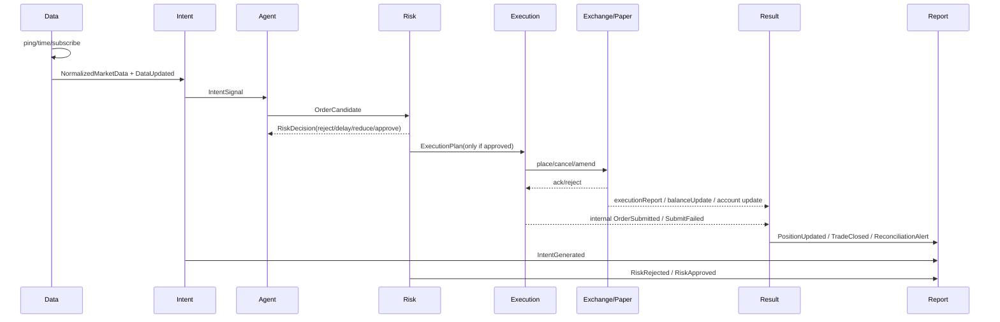
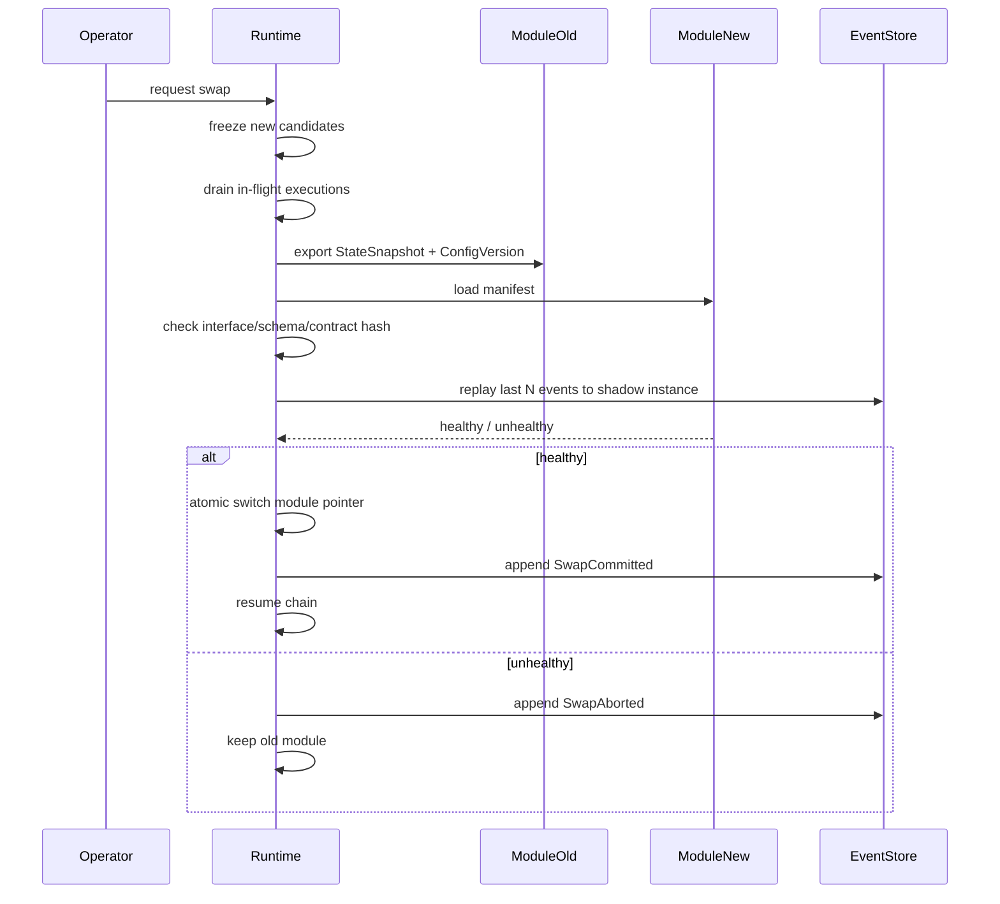

# QuantPilot 模块目标实现细则首次深研报告

执行摘要：当前公开可验证的 QuantPilot 文档，主要覆盖 QuantScript 的内建语义与平台工作流：包括 `Market.Ticker`、`Market.Candles`、`Orders.Buy/Sell/Cancel/Get`、持久化 `State`、以及 `Order/Ticker/Candle/CandleSeries` 等数据类型；但 Data / Intent / Agent / Risk / Execution 这一套协议层模块与事件信封，并未在可访问的公开文档中给出完整定义。因此，下面的实现细则会严格区分三类内容：**官方已公开字段**、**基于主流交易系统模式给出的建议契约**、以及**公开资料未覆盖而必须标注为“未指定”**的部分。citeturn4view2turn5view0turn20view0

执行摘要：在模块层面，最稳妥的方向不是“让每个模块都能直接做更多事”，而是把主链路固定为 **Data → Intent → Agent → Risk → Execution → Result**，由各模块只产出结构化事件与可回放状态，再用读模型生成 UI、回测图表与报告。entity["company","Microsoft","software company"] 的 Azure Architecture Center 与 entity["organization","Hummingbot","open source trading framework"] 的 Controller/Executor 架构，都支持“追加事件 + 派生状态 + 执行隔离”的实现思路；entity["organization","VeighNa","quant trading framework"] 文档则证明“数据管理、事前风控、回测、模拟盘”分层是成熟交易框架中的常见做法。citeturn6search1turn6search2turn17view3turn26view0turn26view1

执行摘要：第二阶段最值得直接落地的，是五个“硬边界”：**显式价格基准**、**每步理由可结构化**、**风控是唯一闸门**、**执行与结果分离并可对账**、**参数与模块替换必须版本化并走安全窗口**。执行适配器应先做 ping / server time / 交易规则预校验，再交由用户流事件驱动订单与持仓状态；而热插拔应采用“暂停—排空—校验—切换—恢复”的安全窗口，而非真运行时卸载动态库，因为 Rust 默认 ABI 并不稳定，动态库卸载的行为也依赖平台与加载方式。entity["company","Binance","crypto exchange"] 文档、entity["organization","Prometheus","monitoring system"] 与 entity["organization","OpenTelemetry","observability standard"] 文档，以及 Freqtrade 的 reload/version 文档，都支持这一判断。citeturn28view6turn28view7turn28view1turn28view2turn11search2turn11search3turn11search5turn24view0turn23view0turn13search10turn12search19turn13search0

## 研究边界与判断前提

本报告只讨论**模块层面**的实现细则：Data、Intent、Agent、Risk、Execution、Result、回测、报告生命周期、参数流式调整、热插拔接口。它**不讨论**系统级能力与非功能性需求，例如多租户、集群调度、成本、容灾、权限体系、部署方式、分布式一致性等；这些问题应另立研究。已知前提中，“主链路不可绕过”“允许 QuantPilot 内建语义与 Rust 原生扩展”“已剔除真·热插拔、任意策略组合、AI 直接插入模块、实时高频调参”，被视为硬约束。citeturn4view2turn5view0turn26view0turn17view3

公开资料能直接支持的 QuantPilot 能力，集中在 QuantScript：市场侧已有 `Ticker` 和 `Candles`；执行侧已有 `Orders.Buy/Sell/Cancel/Get/GetAllOpen/GetAllFinished`；状态侧已有 `State`，并明确说明是跨 `Run()` 持久化的可变字典，最大 1000 keys；数据类型侧公开了 `Order`、`Fee`、`Ticker`、`Candle`、`CandleSeries` 与 `DecimalSeries`。这意味着第二阶段完全可以先用这些公开能力托起 Data / Execution / Result 的第一版契约。相反，Intent、Agent、Risk 的**官方事件名、字段名、枚举值、状态机**在公开资料里都**未指定**，只能采用“建议契约 + 后续与内部协议对齐”的方式推进。citeturn5view0turn19view3turn19view4turn20view0

从外部参考实现看，事件溯源的价值在于：把状态变化存成有序事件序列，然后通过重放恢复历史状态；但代价是必须认真设计 schema 演化、并发与投影。Hummingbot 的做法是把长期决策逻辑放在 controller/script，把有限生命周期、负责下单与订单管理的部分放在 executor；VeighNa 则把历史数据、事前风控、回测研究、本地仿真和图表模块分离。这些模式共同指向同一结论：**模块契约应优先围绕“事件、状态、边界”设计，而不是围绕 UI 或脚本语法设计。**citeturn6search2turn27search1turn26view0turn26view1turn17view0turn18view0

## 模块目标、必备子功能与数据契约

下表中，“官方公开”表示可以直接从公开文档验证；“建议”表示本报告基于 QuantScript、事件溯源、开源交易框架与交易所文档给出的推荐契约；“未指定”表示公开资料没有给出。字段中的 `?` 表示可选。citeturn5view0turn20view0turn6search2turn26view0turn17view3

| 模块 | 目标与必备子功能 | 输入契约 | 输出契约与事件 | 依据 |
|---|---|---|---|---|
| Data | 目标：在运行前可探活，在运行中给出**显式价格基准**与延迟。必备：数据源 ping、server time 校时、订阅/轮询切换、实时价格显示、延迟显示、刷新频率调节、数据陈旧判定。 | `DataSourceConfig{venue:string, symbol:string, market_type:enum[spot,perp,futures], price_basis:enum[last,mark,index,mid], timeframe?:string, mode:enum[ws,rest], refresh_interval_ms:int, stale_after_ms:int, ping_timeout_ms:int}`；官方公开可直接映射到 `Market.Ticker(symbol)` 与 `Market.Candles(timeframe,symbol,limit)`；期货标记价建议接入 `markPrice` 流。 | 建议输出 `NormalizedMarketData{event_id:uuid, symbol:string, price_basis:enum, ts_exchange_ms?:int64, ts_recv_ms:int64, last?:decimal, bid?:decimal, ask?:decimal, mark?:decimal, index?:decimal, candle?:object, lag_ms:int}`；建议事件：`DataPingSucceeded`、`DataPingFailed`、`DataUpdated`、`DataStale`、`DataRateChanged`。 | 官方公开：QuantScript 的 `Ticker/Candles` 与各类型字段；Binance 提供 REST ping/time、WebSocket ping/24h 生命周期、期货 `markPrice` 事件与事件时间。citeturn5view0turn20view0turn28view4turn28view5turn28view6turn28view7 |
| Intent | 目标：把“为什么想买/卖”表达成结构化交易主张，而不是直接下单。必备：多意图参数化、可解释理由、强度/置信度、使用 QuantPilot 语义或 Rust 补语义。 | 建议输入 `IntentInput{market:NormalizedMarketData, state:object, params:object, dependencies:array<string>}`。官方可直接用的上游数据只有 `Ticker/Candles/TA/State`；Rust 扩展 ABI 与调用方式公开资料未指定。 | 建议输出 `IntentSignal{intent_id:uuid, symbol:string, side:enum[buy,sell,flat], strength:decimal[0,1], confidence:decimal[0,1], rationale_code:string, rationale_text:string<=256, basis:enum[last,mark], derived_from:array<string>, ts_ms:int64}`；建议事件：`IntentGenerated`、`IntentSuppressed`。 | QuantScript 已公开 TA 指标、反向索引与 `State`；“理由短文本 + code”的约束是本报告建议，用于后续压缩与可观测。Rust 扩展细节：未指定。citeturn5view0turn20view0turn19view4 |
| Agent | 目标：汇总多个 Intent，形成可执行候选，避免单意图过度暴露。必备：权重合成、冲突处理、缺省空操作、输出解释。 | 建议输入 `AgentInput{intents:array<IntentSignal>, exposure_snapshot:object, open_orders:array<object>, params:{merge_policy:enum[weighted,max_confidence,veto], max_single_intent_weight:decimal}}`。 | 建议输出 `OrderCandidate{candidate_id:uuid, symbol:string, target_side:enum[buy,sell,hold], target_qty:decimal, target_notional?:decimal, source_intents:array<{intent_id,weight}>, merged_reason:string, ts_ms:int64}`；建议事件：`CandidateCreated`、`CandidateDropped`。 | Hummingbot 明确把 controller 与 executor 分离，controller 负责决策，executor 负责离散执行生命周期；本模块契约是据此内推。citeturn26view0turn26view1turn26view3 |
| Risk | 目标：做全局、事前、唯一闸门。必备：下单量限制、活动委托限制、成交频率限制、回撤/仓位/连续亏损规则、批准/减量/延迟/拒绝。 | 建议输入 `RiskInput{candidate:OrderCandidate, account_snapshot:object, position_snapshot:object, open_orders:array<object>, market:NormalizedMarketData, params:object}`。 | 建议输出 `RiskDecision{decision_id:uuid, verdict:enum[approve,reduce,delay,reject], approved_qty?:decimal, risk_score?:decimal[0,1], reason_codes:array<string>, reason_text:string<=512, cooldown_until_ms?:int64}`；建议事件：`RiskApproved`、`RiskReduced`、`RiskDelayed`、`RiskRejected`。 | VeighNa 的 RiskManager 已公开“委托流控、单笔上限、总成交上限、活动委托上限、撤单上限”等事前风控项目；统一闸门化是本报告建议。citeturn17view0turn17view3 |
| Execution | 目标：把通过风控的候选转换成具体交易所请求或模拟盘撮合请求。必备：参数映射、交易规则预校验、下单/撤单/改单、失败分类、用户流订阅。 | 输入建议为 `ExecutionPlan{plan_id:uuid, symbol:string, side:enum, order_type:enum[market,limit], tif?:enum[GTC,IOC,FOK], qty:decimal, price?:decimal, post_only?:bool, route:enum[exchange,paper], client_order_id:string}`。 | 官方公开可对接的请求/响应字段包括 `newClientOrderId`、`side`、`type`、`timeInForce`、`quantity`、`price`；建议内部事件：`ExecutionPlanned`、`OrderSubmitted`、`OrderSubmitFailed`、`OrderUpdated`。外部关键事件：`executionReport`、`listStatus`。 | QuantScript 已公开 `Orders.*` 与 `Order` 状态；Binance 已公开 `newClientOrderId` 唯一规则、`executionReport` 字段、cancel-replace 非事务性、交易规则过滤器与 WebSocket/REST 连接要求。citeturn5view0turn20view0turn28view1turn28view2turn29view2turn29view3turn22search1turn22search7 |
| Result | 目标：把订单事件、余额事件、持仓变化归并成统一结果层。必备：订单状态机、成交汇总、持仓更新、已实现/未实现盈亏、对账。 | 输入：外部 `executionReport` / `balanceUpdate` / `outboundAccountPosition`，以及内部 `OrderSubmitted/OrderUpdated`。 | 建议输出 `OrderView`、`TradeLedgerEntry`、`PositionSnapshot{symbol,qty,avg_entry,mark_price?,unrealized_pnl?,realized_pnl?}`；建议事件：`PositionUpdated`、`TradeClosed`、`BalanceChanged`、`ReconciliationAlert`。 | Binance 用户流公开了订单、余额与账户更新事件；QuantScript `Order` 已公开状态与费用字段；结果读模型是建议实现。citeturn29view0turn29view2turn29view3turn20view0 |

| 模块 | 目标与必备子功能 | 输入契约 | 输出契约与事件 | 依据 |
|---|---|---|---|---|
| 回测 | 目标：可重放、可解释、可画图。必备：按时间序重放事件、K 线叠加信号/成交/风控点、业绩统计、FIFO 配对。 | `BacktestInput{bars:array<OHLCV>, event_log?:array<Event>, fees:object, slippage:object, initial_capital:decimal, contract_spec:object}`。 | 建议输出 `ReplayEventLog`、`EquityCurve`、`DailyPnL`、`BacktestMetrics`、`ChartOverlays`；建议事件：`ReplayStarted`、`ReplayStepApplied`、`ReplayCompleted`。 | VeighNa 已公开：回测需配置数据范围、滑点、手续费、乘数、价格跳动、资金；K 线图可标注买卖点，开平仓连线按 FIFO；回测结果含净值、回撤、每日盈亏、分布。citeturn18view0turn6search11 |
| 报告生命周期 | 目标：保留关键解释，不让内存与日志体积失控。必备：分级、TTL、压缩、摘要投影。 | 输入是所有模块产生的解释类事件与关键结果事件。 | 建议输出 `HotReport`、`WarmSummary`、`ColdLedger` 三层；建议事件：`ReportCompacted`、`ReportExpired`。 | QuantScript 的 `State` 最大 1000 keys；Freqtrade 明确警告在策略内保留过大对象会导致内存增长甚至崩溃；Backtrader 也提供 `exactbars` 以减少内存保留。citeturn19view4turn23view0turn14search7 |
| 参数流式调整 | 目标：运行中改参数，但不破坏主链路和回放一致性。必备：版本号、变更记录、生效边界、回滚。 | 建议输入 `ParameterPatch{change_id:uuid, module:enum, from_version:string, to_version:string, patch:object, reason:string, actor:string, effective_at:enum[next_tick,next_bar,safe_window]}`。 | 建议输出 `ConfigVersion{version_id, module, schema_version, created_at}`, `ChangeLogEntry`, 以及事件 `ConfigPatched`、`ConfigActivated`、`ConfigRolledBack`。 | Freqtrade 公开支持 `/reload_config`，并建议显式 strategy version；事件溯源文献支持把变更作为事件记录与回放。citeturn24view0turn23view0turn6search2turn27search1 |
| 热插拔接口 | 目标：在**非实时安全窗口**完成替换。必备：能力声明、兼容性检查、状态迁移、回退。 | 建议 `ModuleManifest{name,module_kind,interface_version,schema_version,capabilities,requires_state_migration:bool,contract_hash}` 和 `StateSnapshot{module_kind,version,payload_hash,payload}`。Rust 原生扩展 ABI：公开资料未指定。 | 建议事件：`SwapRequested`、`SwapValidated`、`SwapAborted`、`SwapCommitted`、`SwapRolledBack`。 | Rust 参考文档只说明 ABI/Linkage 机制，不承诺默认稳定 ABI；`abi_stable` 提供 load-time type checking 的参考做法；`libloading` 也提示关闭动态库可能受平台影响甚至无效果，所以二阶段应采用安全窗口替换，而不是真热卸载。citeturn13search10turn12search1turn13search0turn13search4turn12search19 |

这一组表的核心结论，是把**交易所原生字段**与**内部模块字段**分开：外部适配器只负责把交易所文档中已知、会变化的字段吸收进来；内部模块只消费稳定、显式、可回放的统一契约。这样可以把交易所升级、用户流事件变化、价格基准切换对上层模块的影响压到最小。citeturn28view1turn29view2turn6search2turn27search8

## 模块交互与时序流程

模块交互应满足两个原则。第一，**Risk 前不可产生任何外部副作用**；第二，**Execution 后的事实状态，只能由 Result 层根据外部回报与内部计划共同归并**，不能回写修改上游判断。这样设计，才符合“可追责、可回放、可复盘”的要求，也与事件溯源和 controller/executor 分离的主流模式一致。citeturn6search1turn6search2turn26view0turn26view1

在实现上，建议每一步都做两件事：一是产出本模块的**结构化输出**；二是同步写入一条**不可变事件**。读模型再从事件流中派生“当前订单列表、当前持仓、当前风险摘要、当前解释摘要、图表叠加层”。这样做的直接好处，是参数调整、回测重放、报告压缩、热插拔前后的状态比对，都能复用同一套事件，而不必为每个功能再补一层旁路。citeturn6search2turn27search1turn27search8

## 错误回退与可观测性

模块错误建议按四类归档。**数据类**：ping 失败、server time 漂移、WebSocket 断连、行情陈旧、价格基准缺失；**决策类**：意图计算异常、意图依赖缺失、Agent 无法合成候选、Risk 参数非法或风控超时；**执行类**：交易规则不通过、下单拒绝、cancel-replace 非事务性导致的部分成功、用户流中断；**结果类**：订单状态与本地视图不一致、余额事件缺失、持仓无法对账。回退要遵循“越靠前越保守”的原则：Data 失败时优先降级为只读或停止新信号；Risk 不可用时直接 fail-closed；Execution 失败时保留计划与外部错误码，不做乐观成交；Result 对账异常时触发只读告警，不反向修改历史事件。citeturn28view5turn28view7turn28view2turn29view2turn17view0turn24view0

可观测性建议按 **trace / metric / log** 三信号分层建设。OpenTelemetry 明确把 trace、metric、log 视为互补信号；Prometheus 则强调应尽量避免高基数标签。因此，“原因长文本”“整段自然语言解释”“完整指标向量”都不应放进 metric label，而应写入结构化日志或报告摘要；metric 只保留低基数字段，例如 `module`、`symbol`、`result`、`reason_code`。citeturn11search3turn11search5turn11search10turn11search2turn11search7turn11search4

| 模块 | 指标 / 事件 | 类型 | 建议标签 | 说明 |
|---|---|---|---|---|
| Data | `data_ping_rtt_ms` | histogram | `venue,market_type` | REST ping 往返时间 |
| Data | `data_lag_ms` | histogram | `symbol,price_basis` | `ts_recv - ts_exchange/event` |
| Data | `data_stale_total` | counter | `symbol,price_basis` | 触发陈旧判定次数 |
| Data | `DataPingFailed` / `DataStale` | structured log | `venue,symbol,reason_code` | 需保留错误详情 |
| Intent | `intent_generated_total` | counter | `symbol,side,rationale_code` | 意图产出量 |
| Intent | `intent_eval_fail_total` | counter | `module_name,error_class` | 计算异常 |
| Agent | `candidate_created_total` | counter | `symbol,target_side,merge_policy` | 候选产出量 |
| Agent | `candidate_drop_total` | counter | `symbol,drop_reason` | 因冲突或空仓 dropped |
| Risk | `risk_reject_total` | counter | `symbol,reason_code` | 拒绝次数 |
| Risk | `risk_reduce_total` | counter | `symbol,reason_code` | 减量次数 |
| Risk | `risk_decision_latency_ms` | histogram | `verdict` | 风控耗时 |
| Execution | `order_submit_total` | counter | `venue,order_type,result` | 提交结果 |
| Execution | `order_ack_latency_ms` | histogram | `venue,order_type` | 提交到 ACK |
| Execution | `order_fill_latency_ms` | histogram | `venue,order_type` | 提交到 FILLED |
| Execution | `OrderSubmitFailed` | structured log | `client_order_id,error_code` | 外部失败必带原始错误码 |
| Result | `reconciliation_alert_total` | counter | `symbol,alert_type` | 对账异常 |
| Result | `position_change_total` | counter | `symbol,side` | 仓位变化次数 |
| 回测 | `replay_events_total` / `replay_speed_eps` | counter/gauge | `symbol,timeframe` | 重放吞吐 |
| 报告 | `report_compaction_ratio` | gauge | `level` | 压缩前后体积比 |
| 参数/热插拔 | `config_change_total` / `swap_duration_ms` | counter/histogram | `module,result` | 版本与替换审计 |

建议配套的日志事件名至少包括：`DataPingStarted`、`DataPingSucceeded`、`DataRateChanged`、`IntentGenerated`、`CandidateCreated`、`RiskRejected`、`ExecutionPlanned`、`OrderSubmitted`、`OrderUpdated`、`PositionUpdated`、`ReplayCompleted`、`ReportCompacted`、`ConfigActivated`、`SwapCommitted`。这些事件名本身是建议，但其设计逻辑与 OTel / Prometheus / 交易所用户流对齐。citeturn11search0turn11search3turn11search2turn29view2turn29view3

## 参数流式调整与安全窗口热插拔

参数流式调整的推荐实现，不是“模块内部把旧值直接改成新值”，而是把每一次参数变更记录成**带版本的变更事件**。最小可行字段可定义为：`change_id`、`module`、`from_version`、`to_version`、`patch`、`reason`、`actor`、`created_at`、`effective_boundary`、`rollback_of?`。生效边界建议只允许三种：`next_tick`、`next_bar_close`、`safe_window`。其中，涉及 Risk 阈值、Execution 路由、订单类型、合约参数的变更，应默认走 `safe_window`；纯显示型或解释阈值参数才允许 `next_tick`。这样做与 Freqtrade 的 stop-reload-restart 实践，以及事件溯源的“变更可回放”原则一致。citeturn24view0turn23view0turn6search2turn27search16

回滚方案建议采用“**版本指针回退，而不是补丁反算**”。也就是说，系统始终保存最近一个稳定版本 `stable_version` 与其摘要哈希；新参数激活前，先在本地用最近 `N` 个事件或 `M` 根 bar 做一次 shadow evaluation，确认不会触发 schema 不兼容、计算异常或风险判断空洞，再切换版本指针。如果切换后发生异常，只需把当前运行模块指回 `stable_version`，并记录一条 `ConfigRolledBack` 事件即可。这样可以避免 patch 链过长时的逆向计算错误。citeturn27search3turn27search8turn24view0

热插拔接口的第二阶段建议定义为**非实时安全窗口替换**。推荐流程如下。第一步，冻结入口：Data 继续接收但不再触发新 Intent；Agent 不再生成新候选；Execution 不再接收新计划。第二步，排空：等待 in-flight 的下单请求进入已知终态，或超时转人工/告警。第三步，快照：导出待替换模块的 `StateSnapshot` 和当前 `ConfigVersion`。第四步，兼容性检查：校验 `module_kind`、`interface_version`、`schema_version`、`contract_hash`、`state_migration_from/to`、`capabilities`。第五步，影子回放：使用最近一小段事件流做 dry-run。第六步，原子切换。第七步，恢复链路并做短期健康检查；若失败，立刻回指旧模块版本。citeturn24view0turn13search0turn13search4turn12search19

这里要特别强调 Rust 扩展边界。公开资料能支持的最保守判断是：**不要把“直接热卸载 Rust 动态库”当成二阶段默认路径**。Rust Reference 只说明 ABI/Linkage 机制，并不提供默认稳定 ABI 保证；`abi_stable` 一类方案之所以存在，正是为了补上运行时加载与 type-checking 的空缺；而 `libloading` 明确提示关闭动态库可能是 no-op、并受平台差异影响。因此，二阶段要么走 **C ABI / ABI-stable 风格的宿主—插件边界**，要么更简单地走 **停机窗口内的重新加载**。这也是为什么本报告把“真·热插拔”继续排除在外。citeturn13search10turn12search1turn13search0turn13search4turn12search19

## 回测事件重放与 K 线标注实现细则

回测引擎建议以“**事件流是事实，图表与报表是投影**”为核心。也就是：账本、订单、持仓、净值、图表标记都不直接保存成唯一真相，而是由 `bars + event_log + contract_spec + cost_model` 重放出来。Fowler 与 Azure 文档都强调，事件溯源的关键价值之一就是历史重构与时间点恢复；EventSourcingDB 文档则进一步强调，读模型应按使用场景专门设计，而非照搬原始事件。citeturn6search1turn6search2turn27search1turn27search8

对你的目标而言，回测至少要分成四层。第一层是**行情层**：标准 OHLCV，外加可选的 `mark price` 序列；第二层是**意图层**：记录每个 IntentSignal 在哪一根 bar 触发；第三层是**执行层**：记录计划、下单、ACK、部分成交、成交、取消、拒绝；第四层是**结果层**：持仓、净值、回撤、当日盈亏。图上只应把二到四层以不同标记叠加到第一层，而不是让单根 K 线承担全部细节。citeturn18view0turn28view4

为了避免未来函数，K 线回测建议采用**信号与成交分离**。VeighNa 社区公开说明：在 bar 级回测中，T 时刻发出的委托，原则上只在 T+1 后撮合；成交价也不等于原始下单价，而是由回测引擎结合后续行情与委托条件撮合得出。对应到你的实现，图上应至少区分两种点：**软标记**是“产生意图/候选”的时刻，通常画在信号 bar；**硬标记**是“成交/风控拒绝/仓位变化”的时刻，通常画在成交或拒绝生效的 bar。这样既能解释策略想法，也不会把“看到信号就同 bar 成交”的未来函数偷带进来。citeturn6search11turn18view0

K 线叠加规则建议如下。买入意图，用空心上箭头；卖出意图，用空心下箭头；实际买入成交，用实心上箭头；实际卖出成交，用实心下箭头；风控拒绝，用 `×`；仓位变化，用阶梯线或副图面积；开平仓连线采用 **FIFO 配对**，与 VeighNa 的 K 线图设计一致。若用户进行了复杂加减仓，仍然按照成交记录自动配对，不直接按意图配对。若采用 bar-only 回测，可在 tooltip 中同时显示 `signal_time` 与 `fill_time`。Backtrader 的 BuySell observer 证明“买卖点图层 + 主图同轴显示”是成熟方案；VeighNa 文档则证明 FIFO 连线与逐笔配对是可操作的。citeturn14search1turn14search7turn18view0

为了让“快速画出 K 线并给出买卖点”真正可用，建议把回测输出拆成两类投影。**轻投影**负责快速打开：只加载 OHLCV、hard markers、position line、关键 risk reject。**重投影**负责深度分析：加载 soft markers、每次意图解释、候选与风控理由、成交明细、收益分解。这种分层与事件溯源中的 snapshot / read model 设计一致，也符合“先快开图，再按需展开细节”的交互需求。citeturn27search0turn27search3turn27search8turn18view0

## 报告生命周期、压缩策略与风险缓解

报告与解释的生命周期，建议不要按“模块来源”划分，而应按“**对回放和审计是否构成事实**”划分。最稳妥的分级是四层：**关键事实层**、**重要解释层**、**调试细节层**、**瞬时运行层**。关键事实层包括下单、ACK、成交、取消、拒绝、风险判定结果、仓位变化、参数版本生效、热插拔切换；这些内容是审计与回测都要用到的，应该长期保留，不做语义压缩，只允许做存储层压缩。重要解释层包括 intent/agent/risk 的短文本说明与 reason code；这些可以热存一段时间，再压缩成窗口摘要。调试细节层包括每 tick/每 bar 的指标值、全部中间向量、冗长解释；这些应设置较短 TTL。瞬时运行层如 heartbeat、RTT 连续样本、成功 ping 明细，只需汇总成指标即可。citeturn19view4turn23view0turn14search7turn11search2

| 级别 | 内容 | 保留阈值建议 | 压缩方式 | 是否参与回放 |
|---|---|---|---|---|
| 关键事实层 | `OrderSubmitted/Updated`、`executionReport`、`RiskRejected/Reduced/Approved`、`PositionUpdated`、`TradeClosed`、`ConfigActivated`、`SwapCommitted` | 默认长期保留；至少覆盖完整回测区间与生产审计窗口 | 仅做二进制/列式压缩，不做语义合并 | 是 |
| 重要解释层 | `IntentGenerated`、`CandidateCreated`、`RiskDecision` 的 `reason_code + short_text` | 热存 7 天或最近 1,000 条/标的；之后转摘要 | 同 `reason_hash` 的连续事件做窗口合并，保留 `count/first_ts/last_ts/max_score` | 可选 |
| 调试细节层 | 每 tick 指标值、长文本解释、全部中间特征 | 热存 24 小时或最近 10,000 条/模块 | delta 编码、采样、窗口聚合；必要时截断文本 | 否 |
| 瞬时运行层 | heartbeat、成功 ping 明细、正常轮询日志 | 仅保留 metrics，不长期保留日志 | 直接丢弃原始文本 | 否 |

这个分级与 QuantScript `State` 的容量边界、Freqtrade 对大对象内存占用的警告、以及 Backtrader 的 `exactbars` 内存优化方向是一致的。换句话说：**解释性不是无限保留原始文本，而是保留关键因果点、压缩重复模式、把查看责任交给投影层。**citeturn19view4turn23view0turn14search7

在当前范围内，主要风险可以这样排序。**高风险项**：其一，QuantPilot 协议层 Data/Intent/Agent/Risk/Execution 的官方 schema 未公开，导致你现在只能先用建议契约；缓解方式是所有内部 DTO 都带 `schema_version` 和 `contract_hash`，并把“未指定”字段隔离在 adapter 层。其二，bar 级回测若不强制 signal/fill 分离，会直接引入未来函数；缓解方式是默认 T+1 撮合、soft/hard marker 分层。其三，交易所改单/撤单可能是非事务性的，部分成功不是异常而是正常情况；缓解方式是 Execution 与 Result 都以用户流事实为准，不做乐观覆盖。其四，热插拔中的状态迁移若无 manifest 和影子回放，极易出现旧模块状态在新模块中失义；缓解方式是安全窗口、manifest 校验、影子回放、原子回滚。citeturn28view2turn6search11turn13search4turn12search19

**中风险项**包括：价格基准混用导致 Result 层盈亏解释错位；交易规则过滤器未预校验导致频繁被交易所拒单；日志 label 高基数导致监控系统膨胀；报告明细与 State 混存导致运行期内存增长。对应缓解方式分别是：强制 `price_basis` 入契约、在 Execution 前做 `exchangeInfo` 预校验、用 `reason_code` 代替长文本 label、把 State 限制为轻量指针与计数器。**低风险项**包括：K 线图初次渲染较慢、参数版本命名不统一、报告 TTL 取值需要按策略风格微调。这些问题都不会破坏主链路，但会直接影响可用性。citeturn22search1turn22search7turn11search2turn11search7turn23view0

基于以上细则，第二阶段可以直接交付的产物应当是：**模块实现细则文档**一份；**Data/Intent/Agent/Risk/Execution/Result 的接口草案**一份；**事件名与 reason_code 初版字典**一份；**示例事件流**两份，分别对应实盘与回测；**K 线叠加示例图**一张，至少包含 soft marker、hard marker、FIFO 连线、风控拒绝点、仓位线；**参数变更与回滚样例**一份；**热插拔 manifest 与兼容性检查清单**一份；**报告分级与压缩规则表**一份。这样做的好处是，下一轮优化可以直接围绕接口和事件流，而不是再回到“功能想象”层重新讨论。citeturn18view0turn24view0turn13search4turn27search1

**开放问题与限制**：当前公开资料并未给出 QuantPilot 协议层的正式 Data / Intent / Agent / Risk schema，也未公开 Rust 扩展在 QuantPilot 中的 ABI、加载方式、状态迁移接口；因此本文相关部分都只能给出“建议契约”，不能替代内部正式协议。另一个限制是，交易所实现细节本研究主要参照了 Binance 的公开文档；如果后续要支持多交易所，需要在 adapter 层补一轮逐所对表。citeturn4view2turn5view0turn20view0turn28view1turn29view2turn13search10