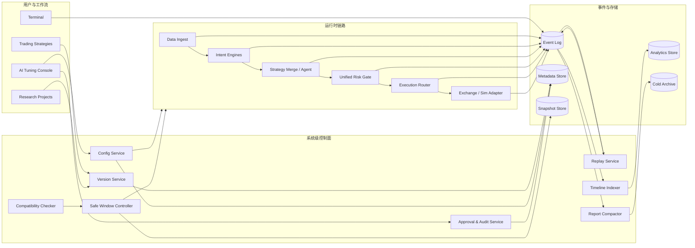
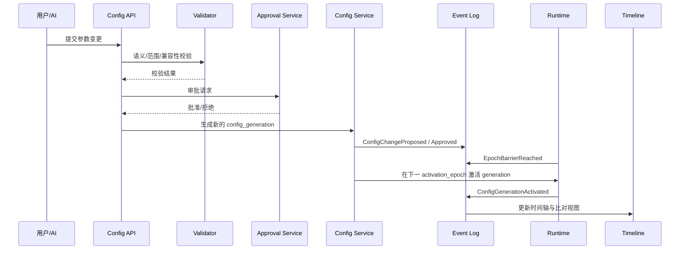
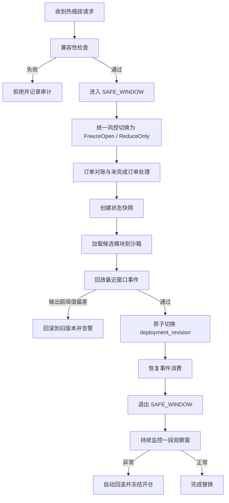

# 第二阶段系统级能力实现细则研究报告

## 执行摘要

本次研究的结论是：第二阶段不应把“系统级能力”理解为零散功能堆叠，而应把它设计成一套**受控的运行时控制平面**。公开的官方文档目前确认了几个已存在的基础：一是 QuantPilot 已将 **Trading Strategies** 与 **Research Projects** 明确分为两套工作流，并支持校验、保存、版本选择与 diff 审阅；二是公开的 QuantScript 文档已经暴露市场数据、下单、订单查询和持久 `State` 原语；三是 Terminal 已能在工作流内手动查看仓位、余额并执行下单。这意味着第二阶段不是从零发明一套新系统，而是在现有策略/研究/终端之上补出一层**统一版本、统一事件、统一风控、统一回放**的控制与审计体系。citeturn4view0turn6view0turn8view0turn29view1turn8view3

更关键的是，公开文档同样暴露了几个会直接影响系统设计的限制：`Market.Candles` 默认/上限窗口有限，`Orders.GetAllFinished` 最多只返回最近 500 条已完成订单，而 `State` 仅是跨 `Run()` 执行持久的轻量字典且上限为 1000 个 key；同时 QuantScript 公开 API 允许脚本直接调用 `Orders.Buy/Sell` 下单。由此可得出两个高置信结论：第一，**长周期回放、统一时间轴、生命周期归档不能依赖运行时查询 API，必须有外置事件日志与历史存储**；第二，**若第二阶段目标是统一风控与受限热插拔，则必须引入“安全运行模式”，禁止策略模块直接触达真实执行 API，而只能发出意图或候选订单**。citeturn8view0turn29view0turn29view1turn30view0

工程基线方面，本报告优先参考了 entity["organization","Apache Kafka","streaming platform"]、entity["organization","Apache Flink","stream processing"]、entity["organization","OpenTelemetry","observability project"]、entity["organization","Prometheus","monitoring system"]、entity["organization","Kubernetes","container orchestration"]、entity["company","ClickHouse","analytics database"]、entity["company","Amazon Web Services","cloud provider"] 和 entity["organization","美国国家标准与技术研究院","us standards institute"] 的官方资料。综合这些来源，最稳妥的第二阶段路线应是：先建立**事件流与版本基座**，再建立**时间轴、回放与报告生命周期**，最后上线**参数流式调整与受限安全窗口热插拔**；AI 调参入口必须放在这些基座之后，并以审计、审批、回测/模拟验证作为前置闸门。citeturn17view0turn21view0turn21view1turn18view0turn18view1turn18view2turn22view0turn28view0turn16view0turn16view1turn16view7

## 目标范围与边界

*本节要点：本次研究只覆盖“可控、可审计、可回滚”的系统级能力，不覆盖此前已明确移除的高风险目标。边界的核心是：允许运行时优化，但不允许绕过统一风控与统一审计。*

结合公开文档现状，这次研究应把系统级能力理解为“围绕策略工作流、研究工作流、终端、版本与运行时状态补出统一控制面”，而不是改写已有编辑器或聊天界面。原因很直接：官方文档已经说明系统具有双工作流、版本审阅、终端、外部数据工具与 QuantScript 运行原语，但没有公开定义运行中配置切换、模块更换、回放、生命周期与 AI 审批协议，因此这些部分都应被当成**第二阶段新增控制面能力**来设计。citeturn4view0turn4view1turn4view2turn8view0turn8view3

| 能力 | 简短定义 | 本次纳入边界 | 明确不包含 |
|---|---|---|---|
| 参数流式调整 | 运行中提交参数变更，并在受控边界激活 | 允许按 generation/epoch 激活；支持回滚、审计、灰度与验证 | 不包含毫秒级闭环自动调参 |
| 模块热插拔（受限安全窗口） | 在暂停窗口内替换模块或模块版本 | 仅允许进入安全窗口后执行；要求快照、兼容性检查、回滚 | 不包含任意时点无暂停替换 |
| 策略合并 | 多策略输出统一进入合并层与统一风控 | 支持多意图聚合、统一风险出口、统一时间轴 | 不包含任意有向图自由重构 |
| AI 调参入口 | AI 只能对参数/候选模块/候选合并方案提出建议 | 必须经过沙箱、回放、模拟、审批与审计 | 不包含 AI 直接生成原生代码并直达实盘 |
| 事件流与回放 | 将运行关键事件追加到可回放日志中 | 支持审计回放、候选模块 shadow replay、时间点恢复 | 不承诺在未捕获输入上实现完全确定性复原 |
| 报告生命周期管理 | 对解释、日志、审计报告进行分层保留 | 保留关键买卖点、仓位变化、异常与审批记录 | 不做无限期全量明细保留 |
| 时间轴统一视图 | 把参数、意图、风控、执行、异常、人工操作放到一条线索上 | 支持 trace、版本、策略、symbol、actor 维度过滤 | 不等同于逐 tick 深度簿重建 |
| 策略版本系统 | 将策略文本、模块版本、配置 generation、部署修订统一版本化 | 支持 diff、回滚、部署关联、审批关联 | 不包含未审计的直接覆盖式编辑上线 |
| 异常可观测 | 对数据、运行时、执行、风控、AI 审批全过程做监控与告警 | 支持 metrics/logs/traces、健康检查、回放验证 | 不包含“仅靠日志人工排查”的被动模式 |

有一个边界必须单独强调：由于公开 QuantScript 文档允许 `Orders.Buy/Sell` 直接发单，第二阶段若要实现统一风控、策略合并和安全窗口热插拔，必须新增一个**受限执行能力模型**。在这个模型里，策略模块和 AI 候选模块只能输出 `Intent` 或 `CandidateOrder`，真实的下单能力只能由执行模块独占；否则统一风险与统一审计将天然被绕过。citeturn30view0

## 架构与接口设计

*本节要点：推荐采用“运行时控制面 + 事件总线 + 分层存储 + 审计批准”的高层架构。内部消息应统一事件信封，外部接口应围绕 version、generation、deployment revision 与 trace id 设计。*

公开文档已经显示策略侧有“验证、保存、版本、diff”，研究侧有“外部工具/MCP 与用户自带密钥”，终端侧有“人工下单、仓位、余额”。因此第二阶段最合理的高层设计不是把所有逻辑塞进脚本运行时，而是建立独立控制面：**配置服务、版本服务、兼容性检查器、安全窗口控制器、统一风控网关、时间轴索引器、回放服务、报告压缩服务**。运行时只负责消费已批准的配置与模块版本，并把领域事件流出。citeturn4view1turn4view2turn8view3turn29view1



### 版本与修订模型

建议把系统里的“版本”拆成四层，而不是只保留一个 strategy version：

| 对象 | 作用 | 是否不可变 | 关键字段 |
|---|---|---|---|
| `strategy_version_id` | 策略逻辑版本 | 是 | `id`、`workspace_type`、`source_hash`、`created_by` |
| `module_manifest_version` | 模块二进制/能力声明版本 | 是 | `module_type`、`abi_version`、`input_schema`、`output_schema`、`state_schema` |
| `config_generation` | 某策略版本上的参数快照 | 是 | `generation`、`strategy_version_id`、`params`、`effective_policy` |
| `deployment_revision` | 一次实际部署的组合快照 | 是 | `revision_id`、`strategy_version_id`、`module_manifest_versions[]`、`config_generation`、`risk_policy_version` |

这样设计的理由是：公开文档已有策略版本切换与 diff 审阅，但运行中参数切换、模块替换和 AI 建议审批显然不是同一种“版本”。把它们统一压成一个版本号，会很快失去审计价值。citeturn6view0turn6view2

### 统一事件信封与消息契约

建议内部消息统一使用 **Protobuf 事件信封**，外部管理 API 使用 **JSON/gRPC**，冷存储导出为 **Parquet/NDJSON**。事件命名保持 PascalCase，与现有文档里的 `Orders.*`、`Market.*`、`State` 风格保持可读一致。下表是建议的核心契约。

| 类别 | 事件/对象名 | 必填字段 | 格式 | 频率建议 | 延迟目标 |
|---|---|---|---|---|---|
| 事件信封 | `EventEnvelope` | `event_id` `event_name` `schema_version` `trace_id` `ts_event` `ts_ingested` `strategy_id` `deployment_revision` `payload` | Protobuf | 全量事件 | P99 写入 < 50ms |
| 参数控制 | `ConfigChangeProposed` | `proposal_id` `target_strategy_version` `requested_params` `actor_type` | Protobuf/JSON | 低频控制事件 | P95 校验 < 300ms |
| 参数激活 | `ConfigGenerationActivated` | `generation` `activation_epoch` `effective_from` | Protobuf | 低频控制事件 | P95 生效 < 1s |
| 模块替换 | `ModuleSwapRequested` | `module_type` `from_manifest` `to_manifest` `reason` | Protobuf/JSON | 低频控制事件 | 请求受理 < 300ms |
| 安全窗口 | `SafeWindowEntered` | `window_id` `pause_mode` `open_order_count` | Protobuf | 低频控制事件 | P95 < 1s |
| 状态快照 | `StateSnapshotCreated` | `snapshot_id` `state_schema` `claim_mode` `size_bytes` | Protobuf | 低频控制事件 | 视状态量而定 |
| 策略合并 | `MergedIntentProduced` | `intent_ids[]` `weights[]` `merged_score` `risk_budget` | Protobuf | 决策周期事件 | P95 < 100ms |
| 回放 | `ReplayRequested` / `ReplayCompleted` | `from_ts` `to_ts` `replay_mode` `base_revision` | JSON + Protobuf | 运维/验证事件 | 准备 < 5s |
| 报告 | `ReportCompacted` | `source_window` `retained_keys[]` `deleted_count` | Protobuf | 批处理 | 分钟级 |
| 时间轴 | `TimelineIndexUpdated` | `trace_id` `primary_key` `facet_keys[]` | Protobuf | 持续写入 | P95 可见 < 2s |
| 异常 | `AnomalyDetected` | `severity` `domain` `symptom` `remediation_hint` | Protobuf | 事件驱动 | P95 < 5s |

下面给出三个最关键的管理接口样例。未指定具体传输协议时，建议同时提供 REST 与 gRPC。

```json
POST /v1/config-changes
{
  "strategy_version_id": "sv_20260428_001",
  "base_generation": 42,
  "requested_params": {
    "ema_fast": 12,
    "ema_slow": 26,
    "risk_budget_bps": 35
  },
  "activation_mode": "NEXT_EPOCH",
  "reason": "narrow drawdown after replay",
  "actor": {
    "type": "human",
    "id": "user_01"
  }
}
```

```json
POST /v1/module-swaps
{
  "deployment_revision": "rev_20260428_007",
  "module_type": "intent",
  "from_manifest": "intent_trend_v3",
  "to_manifest": "intent_trend_v4",
  "swap_mode": "SAFE_WINDOW",
  "compatibility_policy": "STRICT",
  "shadow_replay": {
    "enabled": true,
    "lookback_minutes": 120
  }
}
```

```json
POST /v1/replays
{
  "strategy_id": "stg_btc_01",
  "deployment_revision": "rev_20260428_007",
  "from_ts": "2026-04-20T00:00:00Z",
  "to_ts": "2026-04-27T23:59:59Z",
  "mode": "AUDIT_PLUS_SHADOW",
  "candidate_generation": 43
}
```

### 参数流式调整事件时序

建议参数流式调整遵循“提议—校验—批准—epoch 激活—追踪反馈”的顺序，而不是直接覆盖进运行中上下文。



## 一致性与安全策略

*本节要点：参数调整与受限热插拔必须采用“事务化切换 + 快照/回滚 + 统一风控常驻”的策略。任何能打开新风险敞口的操作，都不能在安全窗口之外完成。*

运行中参数调整最需要解决的不是“怎么改”，而是**什么时候算真正生效**。建议引入 `activation_epoch` 概念：参数通过校验与审批后，只能在下一个决策边界、bar 边界或手工定义的 epoch barrier 生效；运行中所有模块都只读取“当前已激活 generation”的只读视图。这样做可以保证一次决策链路内不会混杂两套参数。考虑到公开 QuantScript 的 `State` 是跨 `Run()` 调用持久化但容量上限有限，因此参数切换不应依赖脚本内部 state 混杂迁移，而应由控制面维护独立 generation 与快照元数据。citeturn29view1

受限热插拔需要比参数调整更强的一致性。这里最稳妥的工程参考是 **Flink 风格的 savepoint**：先获得运行态的一致性快照，再停止/恢复、分叉或更新作业；如果涉及状态算子，必须有稳定的 operator/module ID，模块被删除或重排时要么拒绝切换，要么显式允许未恢复状态。官方文档还明确指出，停止作业并同时生成 savepoint 可以原子完成；并且 canonical 与 native 两种格式分别侧重兼容性与恢复速度。这正好对应第二阶段的两种场景：**计划性替换优先兼容，紧急恢复优先速度**。citeturn21view0turn21view1

事件写入与回滚补偿则建议借鉴 **Kafka** 的幂等与事务化生产者语义：同一个 `transactional.id` 在多实例竞争时会触发 fencing，`initTransactions()` 会处理前一实例未完成事务，消费者需读 `committed` 消息才能得到端到端事务保证。同时官方文档也强调，应用层手工重发不在自动去重范围内，因此第二阶段不能只依靠消息系统本身，仍必须在业务层引入 `idempotency_key` 与 `event_id` 去重。citeturn17view0

这里还要特别指出一个与第二阶段目标直接冲突的现状：公开 QuantScript 文档允许脚本直接发单、取消、查询订单，甚至在脚本内基于 open orders 再决定是否继续下单；但已完成订单查询又只保留最近 500 条。这意味着如果不设置受限执行模式，策略模块既能绕过统一执行层，也会让长期审计与回放断裂。因此建议把真实下单能力收敛到执行模块，策略模块只能产出 `CandidateOrder`；热插拔进入安全窗口时，则必须先做 open order reconcile，并根据策略选择 `drain`、`cancel-open` 或 `reduce-only`。citeturn30view0turn29view0

### 安全窗口热插拔流程



### 统一风控在变更期间的常驻策略

建议把统一风控设计成**不可旁路**的常驻网关，并为变更操作增加专门模式：

| 模式 | 新开仓 | 加仓 | 减仓 | 撤单 | 解释要求 |
|---|---|---|---|---|---|
| `NORMAL` | 允许 | 允许 | 允许 | 允许 | 常规 |
| `FREEZE_OPEN` | 禁止 | 禁止 | 允许 | 允许 | 参数切换/回放验证中 |
| `REDUCE_ONLY` | 禁止 | 禁止 | 允许 | 允许 | 安全窗口/异常 |
| `RECONCILE_ONLY` | 禁止 | 禁止 | 条件允许 | 允许 | 订单状态不一致 |
| `EMERGENCY_HALT` | 禁止 | 禁止 | 条件允许 | 强制执行 | 系统性异常 |

### 失败场景与补救措施

| 失败场景 | 典型症状 | 首选补救 | 验收标准 |
|---|---|---|---|
| 参数 generation 激活后模块输出异常 | 意图分布突变、风控拒绝激增 | 自动回滚上一 generation | 30 秒内恢复，事件链不断裂 |
| 模块 state schema 不兼容 | 快照恢复失败 | 拒绝热插拔、保留旧 revision | 无新 revision 生效 |
| open order 状态不一致 | 本地是 OPEN，交易所已 FILLED | 进入 `RECONCILE_ONLY` 并以交易所为准 | 持仓与订单账一致 |
| 事件重复写入 | 回放中出现重复意图/重复执行 | `event_id + idempotency_key` 去重 | 无重复订单 |
| 回放输入不完整 | 重放结果与线上不一致 | 降级为“近似回放”并显式标记 | UI 显示 `replay_fidelity=partial` |
| AI 建议越权 | 提交了高风险或禁用参数 | 拒绝并保留审计记录 | 无实际配置激活 |

## 性能、存储与生命周期

*本节要点：第二阶段的性能目标应按“非高频、强可审计”来定，而不是按 HFT 定标。存储体系应按热—温—冷分层，并把长明细留给压缩与归档，把关键点留给时间轴检索。*

本报告建议的目标是**控制面低延迟、分析面异步、审计面可追溯**。如果产品未来要进到亚毫秒或高频市场微结构执行，这份架构仍然有价值，但必须额外重构市场数据、撮合前风控、时钟同步与共享内存路径；这一部分本次**不包含**。目前的性能假设更适合分钟级、秒级或至少非 HFT 的策略系统。公开 QuantScript 文档也主要暴露了 ticker、candles、TA 指标与订单原语，没有公开指定更细粒度深度簿输入，因此回放与统一时间轴的确定性保证应以“**已捕获输入粒度**”为边界。citeturn8view0turn23view3

### 关键路径性能目标

| 关键路径 | 建议目标 | 说明 |
|---|---|---|
| 事件总线写入 | P99 < 50ms | 领域事件、控制事件共用统一日志 |
| 参数变更校验 | P95 < 300ms | 不含回放/模拟 |
| 参数 generation 激活 | P95 < 1s | 在下一个 epoch barrier 生效 |
| 策略合并 + 风控裁决 | P95 < 100ms | 单次决策周期内 |
| 安全窗口进入 | P95 < 1s | 不含大体量快照耗时 |
| 轻量状态模块替换 | 2–5s | state 小、无未决订单或已切 `FREEZE_OPEN` |
| 中等状态模块替换 | 10–30s | 需要快照与短窗口 shadow replay |
| 时间轴新事件可见 | P95 < 2s | 异步索引后对 UI 可查 |
| 一日区间回放准备 | < 5s | 已有热存索引 |
| 长周期归档检索恢复 | 30s–数分钟 | 取决于对象存储与恢复层级 |

### 可扩展性建议

建议总线按 `account_id + strategy_id + symbol` 进行分区，以保证同一风险域内事件有序；写入采用 10–50ms 微批，分析入库采用 1–5 秒批量 flush；时间轴索引与报告压缩独立消费，不阻塞决策链路。缓存建议分为三层：L1 进程内只读 generation cache，L2 Redis/内存 KV 保存最近数小时时间轴切片，L3 分析库负责长范围检索。主要瓶颈会出现在分区倾斜、小文件/小 part 爆炸、回放扫宽时间窗和安全窗口期间 backlog 积压。对应的缓解手段分别是：**分区再平衡、批量写入、防止过细分区、冷回放走对象存储导入、暂停窗口期间启用 catch-up replay**。关于分析库存储，ClickHouse 官方明确提醒分区首先是数据管理手段而非通用查询加速工具，并强调过细分区会导致 part 数过多、查询变慢；它也指出 observability 类场景常按天分区，而非更细粒度。citeturn28view0turn28view1turn28view2

### 分层存储设计

建议把数据分成四类：**运行明细事件**、**时间轴索引**、**快照与部署元数据**、**压缩报告与关键事件归档**。ClickHouse 官方文档表明 TTL 可以对行/列执行 move、delete、roll-up，且压缩通常能显著减少磁盘 I/O；分区又与 TTL、冷热存储协同较好。因此第二阶段最合适的方案是：详细事件先落热分析库，随后按 TTL 移到温层或对象存储；时间轴索引保留更久；快照与部署元数据单独持久化；压缩后报告只保留关键买卖点、仓位变化、异常与审批链。citeturn16view0turn16view1turn28view0

公开 QuantScript 文档里，`Market.Candles` 有上限窗口，`Orders.GetAllFinished` 最多返回最近 500 条 finished orders，`State` 也只适合轻量策略状态。因此长期历史、稽核、跨版本 replay 和时间轴分析都必须外置，不能寄希望于运行时 API 反查。citeturn8view0turn29view0turn29view1

### 报告生命周期与保留策略示例

| 数据类 | 热层 | 温层 | 冷层 | 自动动作 |
|---|---|---|---|---|
| 意图/风控明细 | 7–14 天 | 30–90 天摘要 | 不保留全量 | TTL roll-up 为分钟/小时摘要 |
| 执行事件 | 30 天 | 180 天 | 1–3 年关键字段 | 保留订单状态变化与 error_code |
| 时间轴关键点 | 90 天 | 365 天 | 1–3 年 | 永久保留 buy/sell、仓位、风险拒绝 |
| 快照/部署元数据 | 最近 20–50 个 revision | 版本库长期 | 归档副本 | 保证回滚与审计 |
| AI 审批与验证记录 | 90 天 | 365 天 | 1–3 年 | 不可删除，只能归档 |
| 低级别 debug 报告 | 1–7 天 | 不保留或仅摘要 | 不保留 | 超阈值压缩后淘汰 |

### 存储成本估算

下表按**每保留 1 TB·月**做粗略估算，只统计存储费，不含请求、恢复、跨区复制与计算成本。热分析库存储若使用 NVMe/块存储，其成本取决于云盘与副本策略，本报告未指定；因此这里主要用于冷温层对象存储量级判断。

| 存储层 | 参考存储类 | 单价假设 | 1 TB·月成本 |
|---|---|---:|---:|
| 热归档/高频访问 | S3 Standard | USD 0.023 / GB·月 | 约 USD 23.55 |
| 温归档/低频访问 | S3 Standard-IA | USD 0.0125 / GB·月 | 约 USD 12.80 |
| 冷归档/毫秒级取回 | S3 Glacier Instant Retrieval | USD 0.004 / GB·月 | 约 USD 4.10 |
| 深冷归档/极低频恢复 | S3 Glacier Deep Archive | USD 0.00099 / GB·月 | 约 USD 1.01 |

以上价格基于官方公开定价与官方示例页：S3 Standard 首 50TB 为 USD 0.023/GB·月，Standard-IA 为 USD 0.0125/GB·月，Glacier Instant Retrieval 为 USD 0.004/GB·月，Deep Archive 约 USD 0.00099/GB·月；官方文档还明确说明 IA、Glacier 系列存在最小计费对象大小、最短保留期与恢复/请求附加费用，因此真实总成本会高于纯存储费。citeturn26search0turn25search0turn27search2turn27search5turn24view3

## 可观测性与 AI 调参边界

*本节要点：可观测性必须从“日志”升级为“trace + metric + structured log + health check”的统一体系；AI 调参必须是有权限边界、有审批轨迹、有回退开关的受控参与者。*

官方 OpenTelemetry 文档把 logs、traces、metrics 的统一相关性说得非常清楚：日志应带 `TraceId`、`SpanId` 和 `Resource`，这样才能把同一次执行上下文中的跨服务日志与链路追起来；指标也应通过 exemplars、context 与 resource 跟 traces/logs 关联。第二阶段建议把所有关键事件都挂在统一 `trace_id` 上，并为每次参数切换、热插拔、策略合并、AI 提案生成新的根 trace。这样时间轴不只是“时间排序”，而是可展开的因果链。citeturn18view0turn18view1

指标层建议以延迟分布和 backlog 为核心。Prometheus 官方文档强调 histogram 用于分布型指标，尤其适合延迟；而 Prometheus 主站也明确其告警规则基于 PromQL，通知与静默由 Alertmanager 处理。对应到本系统，最少应监控：事件写入延迟、决策链路延迟、风控裁决耗时、安全窗口持续时长、快照大小与耗时、回放吞吐、时间轴索引滞后、异常事件速率、AI 提案被拒率、热插拔回滚率。citeturn16view5turn18view2

健康检查则不应只是“进程活着”。Kubernetes 官方文档区分了 startup、liveness、readiness 三类探针，而 API health 端点又把 `/livez` 与 `/readyz` 明确区分为“是否应该重启”与“是否还能接流量”。第二阶段建议所有关键服务都提供三类健康视图：**ping**（基础连通）、**ready**（依赖已连接、schema 已加载、lag 在阈值内）、**consistency**（最近一次对账成功、generation 一致、事件总线无未提交事务）。对机器判定只看状态码，对人工排障再暴露 verbose 细项。citeturn22view0turn22view1

公开 Terminal 文档表明它可在工作流内手动查看仓位、余额与执行订单，而且是 fully self-custodial 的方案。因此时间轴与异常可观测体系必须把人工操作视为一等公民：任何人工下单、撤单、减仓、终端确认都应带 `actor_type=human_terminal`、`wallet_context` 和 `trace_id`，但**绝不保存私钥或可逆转密钥材料**。另外，Research Projects 的 MCP 集成由用户自带 API key，且不同 provider 的可用工具与成熟度不同，这意味着 AI 研究与 AI 调参链路必须记录 provider provenance，并把 secrets 管理从日志与回放中完全隔离出去。citeturn8view3turn4view2

### 必须落地的监控与日志结构

| 类别 | 最低要求 |
|---|---|
| Metrics | `ingest_lag_ms` `decision_latency_ms` `risk_eval_ms` `execute_latency_ms` `snapshot_duration_ms` `replay_events_per_sec` `timeline_index_lag_sec` `anomaly_rate` |
| Logs | 结构化 JSON；必须包含 `trace_id` `span_id` `strategy_id` `deployment_revision` `event_name` `severity` `actor_type` |
| Traces | 一次参数切换、一轮热插拔、一段 replay、一次执行提交都必须有独立 trace |
| Health | `/ping` `/livez` `/readyz` `/consistencyz` |
| Alerts | backlog、P99 延迟、快照失败、回放失败、热插拔回滚、交易所对账不一致、AI 非法提案激增 |
| 验证工具 | replay diff、snapshot restore check、exchange reconcile、generation drift check |

建议告警阈值的初始基线如下：事件写入 P99 > 100ms 告警；时间轴索引滞后 > 10s 告警；安全窗口 > 30s 且仍未退出告警；回放任务失败率 > 1% 告警；订单对账不一致连续 3 个周期告警；AI 非法/越权提案比率 > 20% 告警。以上阈值是初始运营值，应在实测后再收敛。

### AI 调参安全边界

AI 的职责应是**建议者**，不是**执行者**。这与 NIST AI RMF 的 `Govern / Map / Measure / Manage` 四函数完全一致：先定义治理与风险容忍度，再界定使用场景并测量影响，最后才允许受控上线。citeturn16view7turn15search2turn15search8turn15search16turn15search18

| AI 可执行 | 需附带的控制 | AI 禁止执行 | 原因 |
|---|---|---|---|
| 提交参数候选 | 范围校验、静态规则校验、审批单 | 直接激活 live generation | 绕过人工与风控 |
| 生成候选模块配置 | manifest 校验、shadow replay | 直接替换 live 模块 | 破坏一致性 |
| 触发回测/回放/模拟 | 沙箱、配额、输入留痕 | 直接提交真实订单 | 越权执行 |
| 生成解释摘要 | 标记 `ai_generated=true` | 覆盖人工审计结论 | 篡改审计链 |
| 提出合并权重建议 | 风险预算校验 | 修改统一风控阈值上限 | 提高总暴露 |

建议的 AI 变更流程应固定为：**提案 → 静态策略规则检查 → 历史回放 → 模拟盘验证 → 人类审批 → 小流量灰度 → 全量激活 → 观察窗 → 自动/人工回退**。人类回退机制应至少包括：一键恢复上一 `deployment_revision`、冻结 AI 来源提案、锁定当前风险模式为 `FREEZE_OPEN`、导出本次变更的完整 trace 与审批包。

## 风险评估与实施难度

*本节要点：最高难度不在 UI，而在事件一致性、状态迁移、统一风控常驻和跨层审计。优先级应按“基座先于能力、控制先于智能”排序。*

| 能力 | 难度评级 | 主要技术挑战 | 优先级建议 |
|---|---|---|---|
| 参数流式调整 | 中 | generation 激活边界、回滚一致性、灰度验证 | 高 |
| 模块热插拔（受限安全窗口） | 高 | 状态快照、兼容性检查、订单对账、回滚 | 高 |
| 策略合并 | 中高 | 多策略冲突裁决、统一风险预算、解释一致性 | 中高 |
| AI 调参入口 | 中高 | 权限边界、审批、沙箱与验证链、审计可追溯 | 中 |
| 事件流与回放 | 高 | 统一事件模型、分区有序性、幂等与近似确定性 | 最高 |
| 报告生命周期管理 | 中 | 压缩规则、保留策略、索引与检索平衡 | 高 |
| 时间轴统一视图 | 中 | trace 关联、跨来源时间对齐、查询性能 | 高 |
| 策略版本系统 | 中 | revision 模型、diff、部署绑定、审批绑定 | 最高 |
| 异常可观测 | 中 | 三信号关联、阈值治理、健康检查语义 | 最高 |

如果只看“能不能做”，九项能力都在合理工程边界内；如果看“什么先做最值钱”，则**事件流与版本系统**、**异常可观测**、**参数流式调整**的投资回报最高，因为它们既是后续功能前置条件，也是上线后减少事故与黑箱感的直接抓手。真正最难的是安全窗口热插拔，因为它同时碰到了状态迁移、未决订单、风控模式切换与回滚。

## 交付物、里程碑与建议

*本节要点：建议把第二阶段拆成 5 个可验收阶段。优先交付“事件/版本基座—时间轴/回放—参数流式调整”，再推进热插拔、合并与 AI。*

### 可交付成果与验收标准

| 交付物 | 核心内容 | 验收标准 | 粗略工时 |
|---|---|---|---:|
| 事件总线与统一事件信封 | EventEnvelope、schema registry、分区策略、幂等写入 | 任一核心事件可追到 `trace_id + deployment_revision` | 140–220h |
| 版本与部署台账 | strategy version、module manifest、config generation、deployment revision | 任一线上决策可还原到精确版本组合 | 100–160h |
| 时间轴索引与查询 API | 时间轴聚合、关键点索引、trace 展开 | 24h 内事件查询 P95 < 2s | 120–180h |
| 回放与 shadow replay | 审计回放、候选参数/模块比对回放 | 至少支持 7 天窗口回放与 diff 输出 | 140–220h |
| 参数流式调整服务 | 校验、审批、generation 激活、回滚 | 运行中参数切换不打断链路，30 秒内可回滚 | 100–160h |
| 报告生命周期与压缩服务 | TTL、roll-up、关键点保留、归档 | 详细报告按策略自动淘汰，关键点不丢失 | 80–140h |
| 安全窗口控制器 | pause modes、快照、订单对账、替换/回滚 | 受控热插拔在 30 秒内可完成或回退 | 160–260h |
| 策略合并器 | 多策略权重、冲突裁决、统一风险预算 | 合并结果可解释且不会突破总风险阈值 | 90–150h |
| 可观测与告警栈 | metrics/logs/traces、health、alerts | 任一事故 5 分钟内可定位到 trace 级别 | 100–160h |
| AI 审批与沙箱链路 | AI 提案、静态检查、回放、模拟、审批 | AI 无法直接推 live；全链路有审计 | 120–200h |

### 建议开发里程碑

| 阶段 | 目标 | 典型输出 |
|---|---|---|
| 里程碑 A | 事件与版本基座 | 事件信封、版本台账、trace_id 贯通 |
| 里程碑 B | 时间轴与回放 | 时间轴 API、key moments、审计回放 |
| 里程碑 C | 参数流式调整 | generation 激活、回滚、观察窗 |
| 里程碑 D | 受限热插拔与策略合并 | safe window、snapshot、merge engine |
| 里程碑 E | AI 安全入口与全面运维化 | 审批流、沙箱验证、告警与运营报表 |

### 优先来源与参考层级

本研究建议的资料优先级应固定为：**官方文档 > 官方开源项目文档 > 开源实现经验 > 学术论文/案例**。原因是第二阶段关注的是“控制面与可审计运行时”，而不是单纯模型效果或策略收益。近期关于多智能体金融交易的论文可作为 AI 调参与多角色协作的补充背景，但不应替代事件一致性、状态迁移、生命周期与治理设计。citeturn0search5turn16view7turn15search8

| 来源 | 类型 | 在本研究中的用途 | 优先级 |
|---|---|---|---|
| QuantPilot Help Center / QuantScript Docs | 官方文档 | 确认现有工作流、版本、终端、运行原语边界 | 最高 |
| Kafka / Flink / OpenTelemetry / Prometheus / Kubernetes / ClickHouse 官方文档 | 官方文档 / 开源项目 | 事件、快照、可观测、健康检查、TTL/压缩/分区最佳实践 | 最高 |
| AWS 官方定价与存储类文档 | 官方文档 | 冷温层成本量级估算 | 高 |
| NIST AI RMF / Playbook | 官方治理框架 | AI 提案的治理、审批、验证边界 | 高 |
| 多智能体金融交易论文 | 学术论文 | AI 调参/协作式 agent 的背景参考 | 中 |

### 结论与建议

结论很清晰：第二阶段最应避免的，不是“功能少”，而是**在没有事件基座、版本台账和统一风控的情况下，先做热插拔或 AI 自动化**。只要按顺序落地，第二阶段完全有机会形成一个既灵活、又能解释、还能安全演进的系统级能力闭环。citeturn4view1turn17view0turn21view0turn18view0turn16view0turn16view7

本报告建议优先实施以下三个里程碑。第一，**事件流与版本基座**：因为没有它，就没有回放、没有时间轴、没有审批闭环，也没有热插拔回滚。第二，**时间轴统一视图 + 回放 + 报告生命周期**：因为这是用户真正“看懂系统”的界面层，也是 AI 安全介入前的必要审计层。第三，**参数流式调整 + 统一风控 + 安全窗口控制器**：因为这一步能把“可运行”升级成“可持续运行”，并为后续策略合并与 AI 调参提供受控入口。AI 调参入口应排在这三者之后，作为第四顺位能力推进。citeturn6view0turn8view3turn29view0turn22view1turn15search16

### 开放问题与限制

公开官方文档目前没有给出运行时控制协议、事件模型、回放协议、热插拔 ABI、统一风控接口和策略合并协议的正式规范，因此本报告中相关接口、字段、延迟目标与工时均为**工程化建议稿**，不是对现有官方协议的逐字转述。另一个限制是，公开 QuantScript 文档中未指定更细粒度市场输入契约，因此若未来策略依赖 order book depth、逐笔成交或更高频微结构数据，需要单独补充输入捕获与回放规范；本报告对此部分统一标注为“未指定”。citeturn4view0turn8view0turn29view0