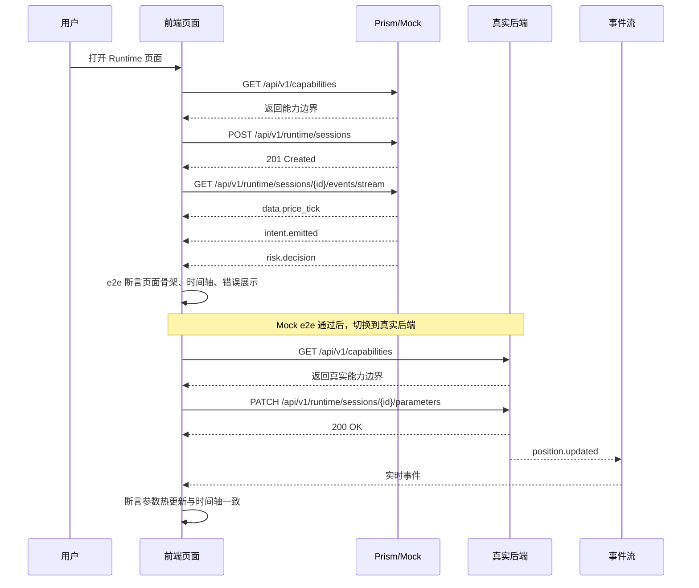

# QuantPilot 第二阶段前后端联动与开发规则规范

## 执行摘要

本规范建议 QuantPilot 第二阶段采用一套强约束但高并行度的流程：**后端优先，但不是先写完后端；而是先冻结接口契约**。HTTP 查询与命令统一以 entity["organization","OpenAPI Initiative","api standard group"] 的 OpenAPI 3.1 作为真源，运行态事件与时间轴统一以 entity["organization","AsyncAPI Initiative","event api standard group"] 的 AsyncAPI 3.1 作为真源；后端先提交契约文档并通过 lint / validate，再由基于契约的 Mock 服务对外提供可联调入口，前端随后先写 e2e 骨架并跑在 Mock 上，最后才接入真实后端。OpenAPI 本身就是“让人和机器都能理解服务能力”的机器可读接口描述，且可被文档、代码生成和测试工具直接消费；AsyncAPI 则面向消息驱动 API，原生覆盖 channels、operations、messages 等事件语义，因此非常适合 QuantPilot 的运行时间轴与事件流。citeturn20view0turn17view0turn7view1turn22view2

这套流程的核心不是“前后端并行开发”这么简单，而是把**联调风险前移**。entity["company","Stoplight","api design platform"] 的 Prism 可以直接从 OpenAPI 文档生成 Mock 并做请求/响应校验，还能作为 validation proxy 帮你在预发布环境识别文档与真实服务的漂移；Pact 的官方建议是消费者契约测试必须调用真实 consumer code，而不是随手写一个 `fetch`/`axios` 替身，同时支持 provider verification 与 `can-i-deploy` 作为发布门禁；Playwright 官方则明确强调测试应面向用户可见行为、使用稳定定位器，并提供 API mocking、HAR 回放、APIRequestContext、trace 与 sharding，这使“前端先搭 e2e，再接真实接口”成为一种可控而不是冒险的工作方式。citeturn12view1turn7view3turn7view14turn7view15turn9view0turn9view3turn11view0turn11view3turn7view9turn10view0

落实到 QuantPilot，建议把 **Data → Intent → Agent → Risk → Execution → Fill** 这条链路映射成两类对外契约：一类是 HTTP 的**控制面契约**，承载 capability discovery、会话创建、参数热更新、快照查询、回放查询；另一类是事件流的**运行面契约**，承载 price tick、intent emitted、risk decision、execution sent、fill received、position updated 等运行态事件。前端必须从 capability 接口获取真实能力边界，不能在 UI 内硬编码“某模块一定可用”；错误语义必须统一；每个运行会话都必须同时具备 snapshot、cursor replay 与 live stream 三种读取方式，这样前端、QA 和回放工具才能复现同一份运行证据链。citeturn20view0turn12view4turn7view6turn19search0

## 推荐流程

下面的流程以“一个中等复杂切片功能”为基准，例如“运行会话创建 + 参数热更新 + 时间轴展示 + 风控拒绝弹窗”。强烈建议按**切片**推进，而不是先做完所有后端再做前端。第一个切片一旦跑通，后续模块就可以复用同一套治理轨道。

| 阶段 | 产出 | 验收标准 | 责任人 | 时间估算 |
|---|---|---|---|---|
| 后端接口设计 | API Change Proposal、资源模型、错误语义、事件模型、兼容性说明 | 已明确 command/query/event；已标注链路节点归属；breaking change 风险已评审 | 后端工程师主责，产品经理/前端/QA参与 | 3–4 天 |
| 文档化 | OpenAPI、AsyncAPI、多文件目录、examples、changelog | lint/validate 全绿；examples 可被 Mock 消费；前端/QA 审阅通过 | 后端工程师主责 | 2–3 天 |
| Mock 服务 | Prism Mock、Mockoon 场景库、启动脚本、测试数据 | happy path / risk reject / data lag 三类场景可复现；前端可直接联调 | 后端工程师 + QA | 2–3 天 |
| 前端 e2e 骨架 | Playwright/Cypress 用例骨架、测试选择器、fixture、失败截图基线 | 核心流程先在 Mock 上跑通；测试文件、fixture、页面占位已入库 | 前端工程师主责，QA参与 | 3–5 天 |
| 接口契约测试 | Pact consumer contract、provider verification、Broker 流程 | consumer 发布契约成功；provider verification 成功；可执行 `can-i-deploy` | 前端工程师 + 后端工程师 | 3–4 天 |
| 前端实现 | 页面与状态管理、生成客户端、时间轴渲染、错误展示 | 不硬编码 schema/capabilities；Mock green，真实后端 smoke green | 前端工程师主责 | 5–8 天 |
| 集成测试 | staging 联调报告、回放验证、事件流一致性验证 | snapshot / replay / stream 三者一致；异常语义统一；性能基线达标 | QA 主责，前后端支持 | 4–6 天 |
| 发布 | 发布单、迁移脚本、回滚方案、灰度与审批记录 | 保护分支状态检查全绿；环境审批完成；烟雾测试通过 | DevOps 主责，后端/QA 参与 | 2–3 天 |

**单切片 Definition of Done** 建议固定为八条：契约文档合入、契约 lint 通过、Mock 可启动、Mock e2e 通过、consumer 契约已发布、provider verification 通过、staging 集成通过、发布清单与回滚方案齐备。


这条流程的关键不是顺序感，而是**进出条件**：没有契约，不得生成 Mock；没有 Mock，不得进入前端 e2e 骨架；没有 consumer / provider verification，不得进入 staging；没有环境审批与回滚方案，不得发布。GitHub 的保护分支、状态检查、CODEOWNERS 与 environment protection rules 都可以为这些门禁提供原生能力。citeturn18view2turn18view3turn7view13

## 接口优先文档化规范

### 基线与目录约定

建议第二阶段采用如下基线：

- **HTTP 契约**：OpenAPI 3.1，YAML，多文件组织。
- **事件契约**：AsyncAPI 3.1，YAML，单入口文件 + 复用组件。
- **OpenAPI 治理**：entity["company","Redocly","api tooling vendor"] CLI 负责 lint、bundle、文档构建。
- **跨 OpenAPI / AsyncAPI 自定义治理**：Spectral 负责团队规则。
- **事件规范校验**：官方 AsyncAPI CLI + 官方 parser 校验。
- **前端客户端生成**：OpenAPI Generator 生成浏览器侧 TypeScript client/types。OpenAPI 文档可直接被文档、代码生成与测试工具消费，OpenAPI Generator 则支持从 2.0/3.x 文档生成客户端、服务端 stub 与文档。citeturn20view0turn24view0turn24view1turn7view6

目录模板建议固定：

```text
contracts/
  openapi/
    root.yaml
    paths/
      capabilities.yaml
      runtime-sessions.yaml
      timeline.yaml
    components/
      schemas/
      responses/
      parameters/
  asyncapi/
    runtime-events.yaml
    messages/
    schemas/
  governance/
    .spectral.yaml
frontend/
  e2e/
  src/api/generated/
backend/
  tests/contract/
mock/
  prism/
  mockoon/
.github/
  workflows/
  CODEOWNERS
```

多文件组织的目的不是“更优雅”，而是让代码审查能按资源、消息、错误模型、链路节点拆开看。Redocly CLI 明确支持对 OpenAPI 文件进行拆分、bundle、治理和 lint，这正适合把 QuantPilot 的 capability、runtime、timeline 和 error model 拆成稳定版块。citeturn24view0

### 必填字段与团队约束

OpenAPI 3.1 根对象至少应具备 `openapi` 与 `info`，且文档必须至少包含 `paths`、`components` 或 `webhooks` 之一；`info.title` 与 `info.version` 为必填。AsyncAPI 3.1 根对象至少应包含 `asyncapi` 与 `info`，并通过 `channels` 与 `operations` 描述应用实际需要实现的消息交互；其 `info.title` 与 `info.version` 也是必填。OpenAPI 3.1 还允许使用 `x-` 前缀的扩展字段，这非常适合承载团队自定义治理元数据。citeturn20view0turn21view3turn22view0turn22view2

因此，QuantPilot 团队规则建议在“规范要求”之外，再叠加以下**强制元数据**：

| 对象 | 必填团队字段 | 说明 |
|---|---|---|
| OpenAPI operation | `operationId`、`summary`、`tags`、`x-owner`、`x-chain-stage`、`x-stability` | 便于跨前后端审查、代码生成、责任归属 |
| OpenAPI response | `application/problem+json` 错误响应、至少 1 组 example | 保证错误统一、Mock 可直接用 |
| AsyncAPI operation | `action`、`channel`、`x-owner`、`x-chain-stage`、`x-stability` | 明确事件是 send 还是 receive |
| AsyncAPI message | `schema_version`、`trace_id`、`event_id`、`occurred_at`、`sequence` | 保证回放、追踪与排序 |
| Schema | example、字段描述、是否向后兼容说明 | 让 FE/QA/Mock 直接消费 |

可以用 Spectral 的内建 `oas` / `asyncapi` ruleset 再叠加团队规则，例如强制 `x-owner`、强制 `operationId`、强制 error response、强制 message envelope。Spectral 官方提供 OpenAPI 与 AsyncAPI 内建 ruleset；AsyncAPI 官方也明确指出“只做规范校验不够，还需要公司级 lint/gov rules”。citeturn13search12turn13search4turn13search16turn7view6

下面是一份可直接入库的 Spectral 规则样例：

```yaml
extends:
  - spectral:oas
  - spectral:asyncapi

rules:
  qp-operation-id-required:
    description: Every HTTP operation must declare operationId
    given: $.paths[*][get,post,put,patch,delete]
    then:
      field: operationId
      function: truthy

  qp-x-owner-required-http:
    description: Every HTTP operation must declare x-owner
    given: $.paths[*][get,post,put,patch,delete]
    then:
      field: x-owner
      function: truthy

  qp-x-owner-required-async:
    description: Every async operation must declare x-owner
    given: $.operations[*]
    then:
      field: x-owner
      function: truthy
```

### 版本策略、兼容性规则与变更流程

版本治理建议分三层：

- **HTTP 路径主版本**：`/api/v1/...`
- **文档版本**：`info.version` 使用 SemVer
- **事件消息版本**：message envelope 内显式 `schema_version`

SemVer 的基本原则是版本号应传达兼容性含义；GitHub 的 REST API 和 Microsoft Graph 则都把 breaking change 视为明确的版本治理事件，并对“删字段、改类型、加 required 参数、改认证要求”等变化给出清晰定义。对 QuantPilot 这种内部但具有多个消费者的系统，最可控的做法不是模仿公有 API 的所有复杂机制，而是**采取更保守的内部规则**：`v1` 内只允许 additive change；一旦删改字段、改语义、改事件 envelope 或修改 cursor 语义，就必须升 major 或拆新 endpoint/event。citeturn7view8turn7view7turn18view0

建议将兼容性规则写死为下面这张表：

| 变更类型 | `v1.x` 是否允许 | 处理规则 |
|---|---|---|
| 新增可选字段 | 允许 | 需补 example，前端需 tolerant reader |
| 新增 endpoint / event type | 允许 | 需补 capability、mock 和 e2e |
| 新增 required 字段/参数 | 不允许 | 新 major 或新 endpoint |
| 删除/重命名字段 | 不允许 | 新 major，并附 migration guide |
| 修改字段类型 | 不允许 | 新 major |
| 修改错误码 / 状态码语义 | 不允许 | 新 major 或新 operation |
| 修改 cursor / replay 语义 | 不允许 | 新 major |
| 新增 enum 值 | 审查项 | 前端必须先支持 unknown value，再放新值 |

接口变更流程必须经过一个**API Change Proposal**。模板建议如下：

```md
## API Change Proposal

### 背景
### 目标
### 影响链路节点
- data / intent / agent / risk / execution / fill

### OpenAPI 变更文件
### AsyncAPI 变更文件
### 兼容性分类
- additive / breaking / internal-only

### 影响消费者
- web frontend
- replay tool
- QA mock
- provider adapters

### Mock 场景
- happy path
- risk reject
- data lag
- capability disabled

### 发布与回滚
### 数据迁移影响
### 需要的 CODEOWNERS 评审
```

### OpenAPI 与 AsyncAPI 片段模板

下面这两个片段不是“示意图”，而是推荐直接成为 QuantPilot 仓库中的起始模板。

```yaml
openapi: 3.1.0
info:
  title: QuantPilot Runtime API
  version: 1.2.0
  summary: Runtime control plane for QuantPilot
  description: HTTP commands and queries for runtime sessions.
servers:
  - url: https://api.quantpilot.local
tags:
  - name: capabilities
  - name: runtime
paths:
  /api/v1/capabilities:
    get:
      operationId: getCapabilities
      summary: Query runtime capabilities
      tags: [capabilities]
      x-owner: backend-runtime
      x-chain-stage: runtime
      x-stability: stable
      responses:
        '200':
          description: Capability map
          content:
            application/json:
              schema:
                $ref: '#/components/schemas/CapabilityResponse'
              examples:
                default:
                  value:
                    modules:
                      execution.paper:
                        supported: true
                      execution.live:
                        supported: false
                        reason: phase2-paper-only
  /api/v1/runtime/sessions:
    post:
      operationId: createRuntimeSession
      summary: Create a runtime session
      tags: [runtime]
      x-owner: backend-runtime
      x-chain-stage: data
      x-stability: beta
      requestBody:
        required: true
        content:
          application/json:
            schema:
              $ref: '#/components/schemas/CreateSessionRequest'
      responses:
        '201':
          description: Session created
          content:
            application/json:
              schema:
                $ref: '#/components/schemas/RuntimeSession'
        '409':
          description: Capability disabled
          content:
            application/problem+json:
              schema:
                $ref: '#/components/schemas/Problem'
components:
  schemas:
    CapabilityResponse:
      type: object
      required: [modules]
      properties:
        modules:
          type: object
          additionalProperties:
            type: object
            required: [supported]
            properties:
              supported: { type: boolean }
              reason: { type: string }
    CreateSessionRequest:
      type: object
      required: [symbol, mode]
      properties:
        symbol: { type: string, example: BTCUSDT }
        mode: { type: string, enum: [paper] }
    RuntimeSession:
      type: object
      required: [session_id, status]
      properties:
        session_id: { type: string, example: ses_01 }
        status: { type: string, enum: [created, running, stopped] }
    Problem:
      type: object
      required: [type, title, status]
      properties:
        type: { type: string }
        title: { type: string }
        status: { type: integer }
        detail: { type: string }
        instance: { type: string }
        error_code: { type: string }
        trace_id: { type: string }
```

```yaml
asyncapi: 3.1.0
info:
  title: QuantPilot Runtime Events
  version: 1.0.0
  description: Event stream for runtime timeline and replay.
servers:
  browser:
    host: api.quantpilot.local
    protocol: http
    pathname: /api/v1/runtime/sessions/{sessionId}/events/stream
channels:
  sessionEvents:
    address: /api/v1/runtime/sessions/{sessionId}/events/stream
    messages:
      runtimeEvent:
        $ref: '#/components/messages/RuntimeEvent'
operations:
  receiveRuntimeEvents:
    action: receive
    channel:
      $ref: '#/channels/sessionEvents'
    x-owner: backend-runtime
    x-chain-stage: timeline
    x-stability: beta
components:
  messages:
    RuntimeEvent:
      payload:
        type: object
        required:
          - event_id
          - session_id
          - sequence
          - occurred_at
          - stage
          - event_type
          - payload
        properties:
          event_id: { type: string, example: evt_1001 }
          session_id: { type: string, example: ses_01 }
          sequence: { type: integer, example: 42 }
          occurred_at: { type: string, format: date-time }
          trace_id: { type: string, example: trc_abc }
          schema_version: { type: string, example: 1.0.0 }
          stage:
            type: string
            enum: [data, intent, agent, risk, execution, fill, position, system]
          event_type: { type: string, example: risk.decision }
          payload:
            type: object
```

上面两个片段分别利用了 OpenAPI 的必填根字段、`info` 结构与 `x-` 扩展能力，以及 AsyncAPI 的 `channels + operations + messages` 结构。OpenAPI 3.1 还基于 JSON Schema 2020-12 dialect，这对共享 schema 与自动校验很有价值。citeturn21view3turn20view0turn17view0turn22view0turn22view2

## Mock、契约测试与前端 e2e 先行

### 推荐工具清单

| 领域 | 默认工具 | 角色定位 | 规则 |
|---|---|---|---|
| HTTP 契约 | OpenAPI 3.1 + Redocly CLI | 文档真源、lint、bundle、文档站 | 合并前必须ผ่าน lint |
| 事件契约 | AsyncAPI 3.1 + AsyncAPI CLI | 事件流真源、规范校验 | 合并前必须 validate |
| HTTP Mock | Prism | 基于契约的真 Mock | 前端联调默认走 Prism |
| 场景 Mock | Mockoon | 演示、探索、QA 场景库 | 不作为契约真源 |
| 契约测试 | Pact | consumer/provider proof | provider 未验证不得发布 |
| 前端 e2e | Playwright | 默认浏览器自动化 | Mock 先绿，再接真后端 |
| 备选前端 e2e | Cypress | 既有团队保持兼容 | 保持相同 contract-first 规则 |
| 客户端生成 | OpenAPI Generator | 生成 TS client/types | 生成代码禁止手改 |
| 发布 CI/CD | GitHub Actions | 状态检查、环境审批、灰度门禁 | main / release 必受保护 |
| 数据迁移 | Flyway | 版本化迁移 | 已应用迁移禁止原地改写 |

Prism 官方支持从 OpenAPI 生成 mock、做请求/响应校验与 validation proxy；Mockoon 支持多响应与规则型场景，但其 HTTP route 默认是独立且无状态的，更适合作为“产品/QA 场景库”而不是契约真源；Pact 要求 consumer test 通过实际 consumer code 发起调用，并支持 provider verification 与 `can-i-deploy`；Playwright 原生支持 API mocking、HAR、APIRequestContext、trace 与 sharding；Cypress 的最佳实践则强调独立测试与 `data-*` 选择器，并以 Real World App 演示成体系做法；Redocly CLI、Spectral 和官方 AsyncAPI CLI 则分别覆盖 OpenAPI 治理、跨规范自定义规则与事件规范校验。citeturn12view1turn11view2turn13search3turn7view3turn7view14turn7view15turn11view0turn11view3turn7view9turn10view0turn15view0turn15view1turn15view3turn24view0turn13search16turn7view6turn24view1turn23view0

### Mock 规则

第二阶段建议明确定义三种 Mock，不混用职责：

**第一种是契约 Mock。**  
使用 Prism，从 OpenAPI 直接启动，是前端日常联调和 CI smoke 的默认入口。它的职责不是“模拟业务逻辑”，而是**确保请求路径、参数、响应体、状态码、examples** 全都与契约一致。示例：

```bash
npx @redocly/cli lint ./contracts/openapi/root.yaml
prism mock ./contracts/openapi/root.yaml -p 4010
```

**第二种是场景 Mock。**  
使用 Mockoon，维护风险拒绝、能力降级、数据延迟、Replay 缺口等“高可读场景集”。它的价值在于 QA 与产品可以不用启动真实后端也能演示完整 UI，但它不应该反向定义接口契约。示例：

```bash
mockoon-cli start --data ./mock/mockoon/quantpilot-risk-reject.json --port 4020
```

**第三种是浏览器侧 Mock。**  
使用 Playwright 的 `page.route()`、`routeFromHAR()` 或 WebSocket mocking，用于少量超前 UI 设计和不稳定第三方依赖隔离。它适合做“临时 UI 驱动”，但一旦 OpenAPI 文档稳定，应该尽快切回 Prism，避免前端自己维护另一套隐性协议。Playwright 官方明确支持拦截 fetch/XHR、HAR 回放以及 WebSocket mock。citeturn11view0turn12view1turn11view2

### Pact 契约测试规则

Pact 在 QuantPilot 中的建议落点不是“所有接口都上”，而是**所有被浏览器消费、且会造成联调风险的 API client** 都应纳入 consumer-driven contract。最关键的一条是：**consumer test 必须调用真实前端 API client / data-access layer**，不能直接在 test 里手写 `fetch()` 充数，否则即便 contract 绿了，真实前端代码仍可能在运行时失败。citeturn7view3

建议 Pact 工作流固定如下：

1. 前端 API client 对 Prism 或 Pact mock provider 产生 consumer contract。
2. contract 发布到 Broker。
3. 后端 provider 在 CI 中做 verification。
4. 成功后把 verification result 回写 Broker。
5. 发布前执行 `can-i-deploy`。

典型 consumer test 片段如下：

```ts
import { PactV4 } from '@pact-foundation/pact';
import { runtimeClient } from '../src/api/runtimeClient';

const provider = new PactV4({
  consumer: 'qp-web',
  provider: 'qp-runtime',
});

test('getCapabilities uses the real frontend api client', async () => {
  await provider
    .addInteraction()
    .given('capabilities are available')
    .uponReceiving('a GET /api/v1/capabilities request')
    .withRequest('GET', '/api/v1/capabilities')
    .willRespondWith(200, {
      'Content-Type': 'application/json',
    }, {
      modules: {
        'execution.paper': { supported: true },
        'execution.live': { supported: false, reason: 'phase2-paper-only' }
      }
    });

  await provider.executeTest(async (mockServer) => {
    const client = runtimeClient({ baseUrl: mockServer.url });
    const res = await client.getCapabilities();
    expect(res.modules['execution.paper'].supported).toBe(true);
  });
});
```

Provider verification 与 `can-i-deploy` 的关键不在“命令能跑”，而在于它为发布提供了一道**基于真实 consumer/provider 兼容矩阵**的硬门。Pact 官方文档明确给出了 provider verification 配置方式，以及在部署脚本中记录 deployment / release 和执行 `can-i-deploy` 的方式。citeturn7view14turn7view15

### 前端先搭 e2e 规则

默认推荐 **Playwright**，理由很直接：它同时覆盖浏览器 e2e、网络 mocking、API 测试、traces、sharding 和定位器生成；官方最佳实践明确要求测试用户可见行为、保持测试隔离、优先使用 role / text / test id 等稳定定位器，并建议在 CI 上启用 retries 与 trace。对“前端先搭 e2e，再接入真实后端”的流程来说，这是一套天然契合的工具链。由于它还提供 `APIRequestContext`，前端完全可以用 API 方式预置测试状态，而不是依赖脆弱的页面前置步骤。citeturn9view0turn9view3turn9view4turn14view0turn14view3turn7view9turn10view0

推荐把前端 e2e 分成三层：

| 层级 | 目标 | 是否必做 |
|---|---|---|
| Mock 骨架层 | 页面骨架、交互路径、错误提示、时间轴 UI | 必做 |
| 契约联调层 | 对接 Prism 的真实契约、验证 UI 与 schema 一致 | 必做 |
| 真实后端 smoke 层 | 对接 staging 后端，验证 capability / event stream / problem details | 必做 |

测试选择器规则建议固定为：

- 首选 `getByRole`
- 次选 `getByText`
- 对业务控件统一配置 `data-pw` 或 `data-testid`
- 禁止长 XPath / 深层 CSS 链

Playwright 官方支持自定义 `testIdAttribute`；Cypress 官方也明确建议使用 `data-cy` / `data-test` 这类测试属性，并强调测试必须独立运行。若团队已经重度投入 entity["company","Cypress","testing tools vendor"]，可以保留 Cypress，但 contract-first 与 Mock-first 规则不能放松。citeturn14view1turn15view0turn15view1turn15view3

一个标准的 Playwright 测试模板可以写成这样：

```ts
import { test, expect } from '@playwright/test';

test('paper session happy path', async ({ page, request }) => {
  // 通过 API 预置测试状态
  await request.post('/__test__/seed', {
    data: { scenario: 'paper-happy-path' }
  });

  await page.goto('/runtime');

  await expect(page.getByTestId('cap-execution-paper')).toContainText('可用');
  await expect(page.getByTestId('cap-execution-live')).toContainText('不可用');

  await page.getByTestId('create-session').click();

  await expect(page.getByTestId('session-status')).toContainText('running');
  await expect(page.getByTestId('timeline')).toBeVisible();

  await expect(page.getByTestId('event-data-price_tick')).toBeVisible();
  await expect(page.getByTestId('event-risk-decision')).toBeVisible();
});
```

测试数据管理建议直接制度化：

- 每个 e2e 用例必须可独立运行。
- 所有 seed 数据都经由 API / task 注入，不手动改数据库。
- Mock 场景文件与 Pact example 统一存放，避免同义不同形。
- 每个运行会话一个独立 `session_id`，每条事件一个独立 `event_id`。
- 所有失败用例强制保留 trace、screenshot、response body。Playwright 默认就支持在 CI 中 `on-first-retry` 录制 trace，并支持合并 shard 报告。citeturn11view3turn7view9turn10view0

下面是一份可直接入库的 CI 片段：

```yaml
name: contracts-and-e2e

on:
  pull_request:
  push:
    branches: [main]

jobs:
  governance:
    runs-on: ubuntu-latest
    steps:
      - uses: actions/checkout@v5
      - uses: actions/setup-node@v5
        with:
          node-version: '22'
      - run: npm ci
      - run: npx @redocly/cli lint ./contracts/openapi/root.yaml
      - run: npx @asyncapi/cli validate ./contracts/asyncapi/runtime-events.yaml

  mock-e2e:
    needs: governance
    runs-on: ubuntu-latest
    steps:
      - uses: actions/checkout@v5
      - uses: actions/setup-node@v5
        with:
          node-version: '22'
      - run: npm ci
      - run: npx prism mock ./contracts/openapi/root.yaml -p 4010 &
      - run: npx playwright install --with-deps
      - run: npm run test:e2e:mock

  provider-contract:
    needs: governance
    runs-on: ubuntu-latest
    steps:
      - uses: actions/checkout@v5
      - run: ./scripts/pact-provider-verify.sh
```

## 联动机制与发布治理

### capability、错误语义与时间轴事件流

QuantPilot 第二阶段建议固定一条前后端联动总规则：**页面不是从“产品想象”渲染，而是从 capability 渲染**。前端必须永远先请求 `GET /api/v1/capabilities`，再决定是否展示某模块、按钮、入口与交互文案。任何模块可用性、运行模式、是否支持实时流、是否支持 replay，都应该来自接口返回，而不是在前端代码里写死 `if (phase === 2) hideLiveTrading` 之类逻辑。

建议 capability 响应至少包含五类字段：

| 字段 | 用途 |
|---|---|
| `supported` | 真正是否可用 |
| `reason` | 不可用时的人类可读原因 |
| `stability` | experimental / beta / stable |
| `since` | 自哪个版本开始支持 |
| `constraints` | 当前模式限制，如 paper-only |

错误语义则建议统一采用 **RFC 9457 Problem Details**。IETF 的 RFC 9457 定义了用于 HTTP API 的 machine-readable error format，并取代 RFC 7807，非常适合作为 QuantPilot 的统一错误壳。团队不应该再让每个模块各自返回 `{ message, code }`、`{ err, reason }`、`{ detail }` 这种不一致结构；统一壳之上再用 `error_code`、`trace_id`、`retryable`、`capability_key` 等扩展字段表达领域信息即可。citeturn19search0turn19search3

推荐错误响应样例如下：

```json
{
  "type": "https://quantpilot.dev/problems/capability-disabled",
  "title": "Capability disabled",
  "status": 409,
  "detail": "execution.live is not available in phase 2",
  "instance": "/api/v1/runtime/sessions/ses_01/start",
  "error_code": "CAPABILITY_DISABLED",
  "trace_id": "trc_7a5f4",
  "retryable": false,
  "capability_key": "execution.live"
}
```

时间轴与事件流建议采用一套统一 envelope，无论底层最终用 SSE 还是 WebSocket，前端看到的消息结构都不应变化。AsyncAPI 是协议无关的，原生适用于 HTTP、WebSockets、Kafka 等消息驱动接口；同时官方校验文档也明确指出，AsyncAPI 文件除了规范校验外，还应叠加公司级 lint 规则。对 QuantPilot 而言，第二阶段最稳妥的做法是：**HTTP 负责控制面，SSE 负责只读事件流；若未来需要双向控制，再扩展到 WebSocket，但事件 envelope 不改。**citeturn7view1turn12view4turn7view6

建议事件读取模式只保留三种，且三者必须等价：

- `GET /snapshot`：拿当前聚合状态
- `GET /events?cursor=...`：拿历史回放窗口
- `/events/stream`：订阅实时流

推荐 event envelope：

```json
{
  "event_id": "evt_1042",
  "session_id": "ses_01",
  "sequence": 1042,
  "occurred_at": "2026-04-28T09:30:00Z",
  "trace_id": "trc_a1b2",
  "schema_version": "1.0.0",
  "stage": "risk",
  "event_type": "risk.decision",
  "payload": {
    "decision": "reject",
    "reason_code": "MAX_POSITION_EXCEEDED"
  }
}
```

团队规则建议写死如下：

- `sequence` 在单一 `session_id` 内严格递增。
- `occurred_at` 一律 UTC ISO 8601。
- `event_id` 可幂等去重。
- `trace_id` 贯穿 HTTP 请求、事件流与日志。
- `snapshot` 必须可以由事件流折叠得出。
- Replay 不能返回与 live stream 不同形状的 payload。

### 版本、灰度、回滚与数据库迁移

发布治理建议采用以下组合：

- 代码合并：受保护分支 + 必须状态检查 + CODEOWNERS
- 环境推广：GitHub environments + required reviewers + branch restrictions
- 契约门禁：provider verification + `can-i-deploy`
- 数据库迁移：Flyway versioned migrations + 只做前向兼容迁移
- 灰度目标：`dev` → `staging` → `paper-prod`

GitHub 官方支持用 protected branches 强制 PR review 和 status checks，也支持 CODEOWNERS 对特定目录施加审查责任；environments 还能要求人工审批、延迟或第三方保护规则。对 QuantPilot 这类“接口/事件/前端/回放强耦合”的系统，这些门禁不应当是“上线前补一下”，而应在第二阶段一开始就配好。citeturn18view2turn18view3turn7view13

数据库迁移建议使用由 entity["company","Redgate","database devops vendor"] 维护的 Flyway 式版本化迁移思路：**迁移只按顺序执行一次，已应用迁移不得原地修改，必须用新的 versioned migration 向前修正**。这意味着 QuantPilot 第二阶段要尽量避免“上线后回退 SQL 文件内容”的做法，而应统一采用“expand → deploy code → cleanup”的保守方式：先加新表/新列/新索引，再让代码同时兼容旧新结构，最后等旧实例彻底退出后再执行清理。Flyway 官方明确说明 versioned migrations 仅执行一次，并依赖 checksum 检测变更，且最佳实践是不修改已经应用到下游环境的 migration。citeturn23view0

建议发布检查单固定包含：

| 检查项 | 必须 |
|---|---|
| OpenAPI / AsyncAPI 文档已更新 | 是 |
| Mock 与 examples 已更新 | 是 |
| Pact verification 结果为绿 | 是 |
| capability 变更已同步到前端 e2e | 是 |
| Problem Details 映射完整 | 是 |
| Flyway migration 已评审 | 是 |
| staging smoke 与 replay smoke 通过 | 是 |
| 回滚 artifact 与回滚步骤存在 | 是 |

## 仓库规则、质量基线与风险矩阵

### 分支、PR 与审批规则

建议采用**轻量 trunk-based** 分支策略：

- `main`：唯一长期主干，始终可发布
- `feat/<area>-<topic>`：短生命周期功能分支
- `fix/<area>-<topic>`：短生命周期修复分支
- `release/<date>`：仅在需要冻结验收时创建
- `hotfix/<issue>`：生产修复分支

分支保护建议这样配置：

- `main` 必须开启 protected branch
- 至少 1–2 个 approving reviews
- 必须通过 status checks
- 禁止直接 push
- API / 合约目录启用 CODEOWNERS
- `contracts/openapi/**`、`contracts/asyncapi/**` 的 PR 必须由前端、后端、QA 三方至少两方审过

GitHub 官方已经原生支持 protected branch 与 CODEOWNERS，这足以满足第二阶段的审批门禁。citeturn18view2turn18view3

建议 `CODEOWNERS` 起步模板：

```text
*                             @pm-team
/contracts/openapi/           @backend-team @frontend-team @qa-team
/contracts/asyncapi/          @backend-team @frontend-team @qa-team
/frontend/e2e/                @frontend-team @qa-team
/backend/tests/contract/      @backend-team @qa-team
/mock/                        @frontend-team @qa-team
```

建议 PR 模板：

```md
## 变更摘要
## 是否涉及接口/事件契约
- [ ] 否
- [ ] 是，已更新 OpenAPI
- [ ] 是，已更新 AsyncAPI

## 兼容性
- [ ] additive
- [ ] breaking（已附 migration guide）

## Mock 与测试
- [ ] Prism example 已更新
- [ ] Mockoon 场景已更新
- [ ] Pact consumer/provider 已更新
- [ ] e2e 已更新

## 发布与回滚
- [ ] 无 DB 迁移
- [ ] 有 DB 迁移，已附脚本
- [ ] 已附回滚方案

## 影响链路节点
- [ ] data
- [ ] intent
- [ ] agent
- [ ] risk
- [ ] execution
- [ ] fill
```

### 自动化检查、质量目标与监控告警

建议 CI 至少包含以下自动化检查：

| 检查 | 工具 | 合并门禁 |
|---|---|---|
| OpenAPI lint / bundle | Redocly CLI | 必须 |
| OpenAPI / AsyncAPI 团队规则 | Spectral | 必须 |
| AsyncAPI validate | AsyncAPI CLI | 必须 |
| HTTP Mock smoke | Prism | 必须 |
| consumer contract | Pact | 触发时必须 |
| provider verification | Pact | 触发时必须 |
| Mock e2e | Playwright | 必须 |
| staging smoke | Playwright | 发布前必须 |
| migration check | Flyway | 有迁移时必须 |

Redocly CLI 面向 OpenAPI 生命周期治理，Spectral 提供内建 OpenAPI/AsyncAPI ruleset 并可自定义规则，AsyncAPI CLI 提供官方 validate；这些组合起来，正好构成“规范正确 + 团队规则正确”的双层门禁。citeturn24view0turn13search12turn13search4turn7view6

QuantPilot 第二阶段建议一开始就设定可执行的质量基线，而不是“先做完再优化”：

| 指标 | 目标 |
|---|---|
| 所有浏览器消费的 HTTP endpoint 纳入 OpenAPI | 100% |
| 所有浏览器消费的事件流纳入 AsyncAPI | 100% |
| P0 用户流程自动化覆盖 | ≥ 90% |
| Mock e2e smoke 时长 | ≤ 10 分钟 |
| 全量 e2e 时长 | ≤ 25 分钟，必要时启用 sharding |
| 失败用例保留 trace/screenshot/response | 100% |
| replay 可复现测试 | 每次 nightly 必跑 |
| capability 与 UI 一致性 smoke | 每次 PR 必跑 |
| 事件流 p95 端到端渲染延迟 | ≤ 2 秒 |
| staging API p95 | 读 ≤ 300ms，写 ≤ 500ms |

Playwright 官方支持 trace、retry 与 sharding，足以把“失败可诊断性”和“套件时长”同时控制住。citeturn7view9turn10view0

建议告警按四类建设：

- **契约告警**：OpenAPI / AsyncAPI lint fail、provider verification fail
- **运行告警**：事件流 gap、sequence 回退、snapshot / replay 不一致
- **前端告警**：capability 与页面入口不一致、problem details 映射缺失
- **发布告警**：迁移失败、staging smoke fail、can-i-deploy fail

### 风险矩阵

| 风险 | 典型信号 | 影响 | 缓解措施 |
|---|---|---|---|
| 文档落后于实现 | 前端联调靠口头说明 | Mock 与真实不一致，返工高 | 契约先于代码；无文档不准合并 |
| 前端硬编码能力边界 | UI 展示与 capability 不一致 | 上线后出现“按钮可见但不可用” | 所有入口由 `/capabilities` 渲染 |
| Mock 漂移 | Mock 能过，真实后端失败 | 联调期集中爆雷 | Prism 作为真 Mock；Mockoon 只做场景 |
| Pact 形同虚设 | 测试直接写 `fetch()` | consumer 代码仍可能跑挂 | Pact 测试必须走真实 API client |
| e2e 脆弱 | 使用深层 CSS/XPath，频繁 fixed wait | CI 不稳定、误报高 | role / test id 选择器，禁止固定等待 |
| 事件语义不统一 | 实时流、回放、快照字段不同 | 回放工具不可用 | 统一 envelope，固定 `event_id/sequence/schema_version` |
| 破坏性迁移 | 直接删列/改列名 | 线上回滚失败 | 只做前向兼容迁移，cleanup 延后 |
| 发布门禁形同虚设 | 合同未验证直接进 staging | 兼容问题进入后期 | protected branch + env approval + can-i-deploy |

## QuantPilot 实施示例与三个月里程碑

### 面向链路的具体接口示例

围绕 QuantPilot 的 **Data → Intent → Agent → Risk → Execution → Fill** 链路，建议第二阶段先固定下面这组 HTTP 控制面接口：

| 接口 | 作用 | 对应链路 |
|---|---|---|
| `GET /api/v1/capabilities` | 拉取真实能力边界 | 全局 |
| `POST /api/v1/runtime/sessions` | 创建运行会话 | data |
| `POST /api/v1/runtime/sessions/{id}:start` | 启动会话 | data |
| `POST /api/v1/runtime/sessions/{id}:stop` | 停止会话 | 全局 |
| `PATCH /api/v1/runtime/sessions/{id}/parameters` | 热更新参数 | intent / agent / risk |
| `GET /api/v1/runtime/sessions/{id}/snapshot` | 取当前聚合态 | 全局 |
| `GET /api/v1/runtime/sessions/{id}/events` | 取历史事件窗口 | 全局 |
| `GET /api/v1/runtime/sessions/{id}/events/stream` | 订阅实时事件流 | 全局 |
| `GET /api/v1/runtime/sessions/{id}/replay` | 驱动回放页面 | 全局 |

时间轴事件类型则建议从一开始就只允许白名单：

- `data.price_tick`
- `data.lag_detected`
- `intent.emitted`
- `agent.aggregated`
- `risk.decision`
- `execution.sent`
- `fill.received`
- `position.updated`
- `system.warning`

这能保证前端时间轴、回放播放器、告警面板共享一套事件语义，而不会各自长出私有字段。

### Mock 场景清单

第二阶段建议至少准备四个标准场景：

| 场景 ID | 目的 | 必测断言 |
|---|---|---|
| `paper-happy-path` | 正常跑通主链路 | 从 data 到 fill 事件完整可见 |
| `risk-reject-max-position` | 验证风控拒绝链路 | 出现 `risk.decision=reject`，且无 execution / fill |
| `data-lag-warning` | 验证延迟告警与降级 UI | 时间轴出现 lag 事件，页面有 warning badge |
| `capability-paper-only` | 验证能力发现与入口控制 | live execution 入口不可点击，有明确 reason |

### e2e 时序图



### 三个月里程碑

下面是一套在 **12 周内可交付** 的里程碑方案，适合 3–6 人团队：

| 时间 | 里程碑 | 可交付物 |
|---|---|---|
| 第 1–2 周 | 契约与治理基线 | `contracts/` 目录、Redocly/Spectral/AsyncAPI CLI、protected branch、CODEOWNERS、PR 模板 |
| 第 3–4 周 | HTTP 契约与 Mock 跑通 | `capabilities`、`runtime/sessions`、`snapshot` OpenAPI；Prism 可启动；前端 mock e2e 首批通过 |
| 第 5–6 周 | 事件契约与时间轴骨架 | AsyncAPI runtime-events、SSE/stream 契约、时间轴页面骨架、risk reject / data lag 场景 |
| 第 7–8 周 | Pact 契约闭环 | consumer contract、provider verification、Broker、can-i-deploy 脚本 |
| 第 9–10 周 | 前后端真实联调 | capability 同步、Problem Details 统一、参数 PATCH 热更新、snapshot / replay / stream 一致性验证 |
| 第 11 周 | 发布治理与迁移硬化 | GitHub environment 审批、staging smoke、Flyway 迁移流程、回滚清单 |
| 第 12 周 | 第二阶段验收 | 完整演示链路、e2e/契约测试报告、性能基线、风险遗留清单 |

---

## 附录 A: v0.2.0 实施现状 (2026-04-30 终验)

### 契约文档现状

| 文档 | 状态 | 说明 |
|------|------|------|
| `contracts/openapi/root.yaml` | ✅ 就绪 | ~80 端点完整文档，含全部 Block 5 端点 + v0.1 核心路由 |
| `contracts/asyncapi/runtime-events.yaml` | ✅ 就绪 | SSE 事件流契约 |
| `contracts/governance/.spectral.yaml` | ✅ 就绪 | 7 条团队 lint 规则 |
| Prism Mock | ❌ 未实施 | 文档建议但未部署；当前前端直接对接开发后端 |
| Pact 契约测试 | ❌ 未实施 | 文档建议但未实施；集成测试覆盖关键路径 |

### 错误格式迁移状态

| 格式 | 使用范围 | 迁移计划 |
|------|---------|---------|
| RFC 9457 `problem_*` | Block 5 新增代码 100% | 目标格式 |
| 遗留 `json_bad_request` | v0.1 代码 (~70 处) | v0.3 逐模块迁移 |
| 原始 `io_error` 字符串 | v0.1 文件 I/O 错误 | v0.3 替换为 `problem_internal` |

**关键约束**: 不重写 v0.1 工作代码。错误格式迁移在后续迭代中按模块推进。

### 已删除的遗留死代码

| 删除项 | 原位置 | 原因 |
|--------|--------|------|
| `CompileDiagnosticSeverity::Info` | `frontend_api_types.rs` | 从未构造 |
| `CompileDiagnosticTargetScope::Edge` | `frontend_api_types.rs` | 从未构造 |
| `HotSwapOrchestrator.risk_checker` | `qrpc_runtime/hotswap.rs` | 存储但从未读取 |
| `HotSwapOrchestrator.core_ir` | `qrpc_runtime/hotswap.rs` | 存储但从未读取 |
| `load_json<T>` | `runtime_persistence.rs` | 从未调用 (仅 write path 使用) |
| `security_violation_detected_event` | `runtime_event_projection.rs` | 仅测试使用，移入 `#[cfg(test)]` |

---

## 附录 B: 后续开发指引 (v0.3+)

### 优先事项

1. **错误格式全量迁移**: 将 v0.1 模块 (~70 处 `json_bad_request`) 迁移至 RFC 9457 `problem_*` 格式
2. **Prism Mock 部署**: 基于 `contracts/openapi/root.yaml` 启动 Prism 实例，前端 e2e 切换到 Mock
3. **Pact 契约闭环**: 前端 consumer contract → Broker → provider verification → can-i-deploy
4. **AsyncAPI 运行时对齐**: SSE 事件格式与 `contracts/asyncapi/runtime-events.yaml` 完全对齐
5. **x-chain-stage 运行时门禁**: 基于 OpenAPI `x-chain-stage` 元数据实现链路阶段 gating

### 开发思想约束 (持续生效)

- **契约先于代码**: 任何新 API 必须先更新 `contracts/openapi/root.yaml`，再实现
- **错误格式统一**: 所有新 HTTP handler 必须使用 RFC 9457 `problem_*` 函数
- **能力驱动渲染**: 前端不得硬编码模块可用性，所有入口由 `/api/capabilities` 驱动
- **AI 在审批链之后**: 任何 AI 产出不得绕过 static check → sandbox → approval → epoch barrier
- **文档 ≥ 代码**: 文档描述的能力不得落后于代码实现；删除代码时必须同步更新文档

如果只能再压缩一次，我的建议是：**优先确保“契约文档 → Mock → e2e → Pact → 发布门禁”这条主轨稳定运行**。只要这条主轨稳定，QuantPilot 第二阶段后续所有模块化目标都可以在这条轨道上持续演进；如果这条轨道不稳，功能越多，联动成本只会越高。